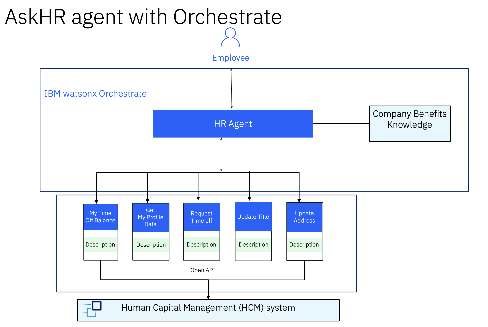

# 🧑‍💼 AskHR

모든 대규모 조직이 직면하는 주요 과제 중 하나는 인사(HR) 운영 관리입니다. 회사가 성장함에 따라 정보를 더 빨리 얻고 작업을 쉽게 실행하는 것이 점점 더 어려워집니다. 에이전트 시스템(Agentic systems)의 출현과 추론 모델의 강력한 기능 덕분에 거의 모든 HR 운영을 수행할 수 있는 단일 진입점을 갖는 것이 더 쉬워졌습니다.

## 🤔 문제점

10만 명의 직원을 둔 글로벌 IT 선두 기업인 TechCorp Inc.는 증가하는 HR 운영 관리에 상당한 어려움을 겪었습니다. 회사가 확장됨에 따라 직원 프로필 데이터, 휴가 요청, 인력 관리를 효율적으로 처리하는 데 어려움을 겪었습니다. 기존의 HR 시스템은 더 이상 규모와 복잡성을 따라잡기에 충분하지 않았습니다. 다양한 HR 운영에 여러 공급업체의 도구를 사용하면서 이들 모두를 통합하고 사용자에게 원활한 경험을 제공하기는 어렵습니다.

## 🎯 목표

이 유스케이스를 통해 우리는 에이전트 기능을 갖춘 엔터프라이즈급 플랫폼인 watsonx를 채택하여 이 과제를 해결하고자 합니다.
이 실습에서는 watsonx Orchestrate의 기본 제공 도구를 사용하여 Workday, SAP SuccessFactors 등과 같은 HR 관리 도구에 연결하거나, 이러한 시스템에 쉽게 연결할 수 있는 맞춤형 도구를 만드는 방법을 살펴볼 것입니다. 에이전트 기반 통찰력을 통해 TechCorp이 정보 검색을 가속화하고, 관리 부담을 줄이며, 더 효율적이고 효과적인 인력을 확보하도록 돕겠습니다.

## 📈 비즈니스 가치

AI 기반 시스템을 사용하여 HR 프로세스를 최적화하면 더 빠른 해결 시간, 더 높은 사용자 만족도, 수익 증대, 직원 번아웃 감소와 같은 다차원적인 영향을 미칠 수 있으며, 이는 궁극적으로 비즈니스 가치에 긍정적인 영향을 미칩니다. 한편, 에이전트 기능을 활용하면 데이터 안전성 향상, 환각 없는 더 근거 있는 응답 제공 등 그 자체로 추가적인 가치를 창출하여 브랜드 경험을 향상시킬 수 있습니다.

## 🏛️ 아키텍처

직원과 HR 시스템 간의 상호 작용을 간소화하기 위해 IBM watsonx를 사용하여 AI 기반 AskHR 에이전트를 설계했습니다. 이 솔루션은 지능적인 추론, 원활한 작업 실행, 직원을 위한 반응형 경험을 보장하는 다중 에이전트 오케스트레이션 모델을 활용합니다. 아키텍처는 watsonx Orchestrate로 구축되어 HR 에이전트가 광범위한 HR 관련 문의 및 요청을 효율적으로 관리할 수 있도록 합니다.

#### AskHR 에이전트의 주요 기능:

1. 휴가 잔여일 확인, 휴가 신청, 직원 정보 업데이트와 같은 일상적인 HR 작업을 자동화합니다.

2. 직관적인 앱 인터페이스를 통해 직원과 백엔드 HR 시스템 간의 자연스러운 상호 작용을 가능하게 합니다.

3. 추론 및 도구를 사용하여 정보를 안전하고 안정적으로 가져오거나 업데이트합니다.

4. OpenAPI 커넥터를 사용하여 내부 시스템과 원활하게 통합됩니다.

5. 이 시스템은 watsonx Orchestrate를 활용하여 조정, 고급 추론 및 웹 기반 작업을 수행하며 포괄적인 AI 기반 HR 지원 경험을 제공합니다.

### 아키텍처 구성 요소

- **HR 에이전트 및 앱 (IBM watsonx Orchestrate)**: HR 에이전트는 중앙 오케스트레이터 역할을 하여 사용자 상호 작용을 관리하고 HR 앱의 적절한 도구에 작업을 위임합니다.

OpenAPI 및 회사 복리후생 지식 문서로 구동되는 재사용 가능한 도구 모음을 가지고 있습니다. 각 도구는 다음과 같은 특정 HR 관련 작업을 수행하도록 설계되었습니다:
휴가 잔여일 확인
휴가 신청 제출
개인 정보 업데이트(직책, 집 주소)

HR 에이전트는 회사 복리후생 지식 문서에서 관련 정보를 검색하여 관련 질문에 답변합니다.

- **인적 자본 관리(HCM) 시스템**: HR 앱은 기본 HCM 시스템과 통신하여 직원 데이터를 가져오거나 업데이트하여 실시간 동기화와 정확성을 보장합니다.

> [!IMPORTANT]
> 이 실습에서는 인적 자본 관리 시스템용 시뮬레이터를 사용합니다. 하지만 이는 Workday 등과 같이 프로덕션에서 실행 중인 실제 시스템으로 쉽게 변경할 수 있습니다.

## 📄 단계별 실습 지침

이 사용 사례를 구현하는 방법에 대한 단계별 지침은 [여기](./hands-on-lab-askHR_kr.md)에서 찾을 수 있습니다.