# 🧑‍💼 AskHR: 에이전트 AI로 HR 작업 자동화

## 목차

- [사용 사례 설명](#use-case-description)
- [아키텍처](#architecture)
- [사전 준비사항](#pre-requisites)
- [핸즈온 가이드](#핸즈온-가이드)
  - [에이전트 빌더 열기](#에이전트-빌더-열기)
  - [HR 에이전트 생성](#hr-에이전트-생성)
  - [미리보기에서 HR 에이전트 테스트](#미리보기에서-hr-에이전트-테스트)
  - [AI 채팅에서 HR 에이전트 테스트](#hr-agent-ai-chat-테스트)

## 사용 사례 설명

이 사용 사례는 제공된 아키텍처 다이어그램에 설명된 대로 IBM watsonx Orchestrate를 활용하여 AskHR 에이전트를 개발하고 배포하는 것을 목표로 합니다. 이 에이전트는 직원들이 대화형 AI를 통해 HR 시스템과 상호 작용하고 정보에 효율적으로 액세스할 수 있도록 지원합니다.

이 실습에서는 watsonx Orchestrate에서 HR 에이전트를 구축하고, 도구와 외부 지식을 활용하여 시뮬레이션된 인적 자본 관리 시스템에 연결합니다. 이 에이전트는 문서에서 관련 정보를 검색하여 사용자 쿼리에 답변하고 사용자가 자신의 프로필을 보고 관리할 수 있도록 합니다.

## 아키텍처


## 사전 준비사항

 - 계속하기 전에 강사에게 **모든 시스템**이 정상적으로 실행되고 있는지 확인하십시오.
 - 이 실습에 적합한 TechZone 환경에 액세스할 수 있는지 확인하십시오.
 - 실습을 시작하기 전에 강사가 공유할 자격 증명 파일에 액세스할 수 있는지 확인하십시오.
 - 이 실습을 진행하는 강사인 경우 **강사 가이드**를 확인하여 모든 환경과 시스템을 설정하십시오.


## 핸즈온 가이드

### 에이전트 빌더 열기

 - IBM Cloud(cloud.ibm.com)에 로그인합니다. 왼쪽 상단의 햄버거 메뉴로 이동한 다음 리소스 목록으로 이동합니다. AI/Machine Learning 섹션을 엽니다. **watsonx Orchestrate** 서비스가 표시되면 클릭하여 엽니다.

  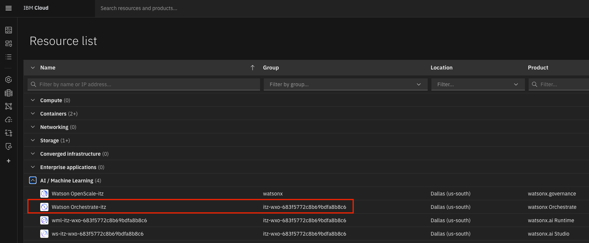

 - "watsonx Orchestrate 시작" 버튼을 클릭합니다.

   

 - watsonx Orchestrate에 오신 것을 환영합니다. 햄버거 메뉴를 열고 **빌드** 옆의 아래쪽 화살표를 클릭합니다. 그런 다음 **에이전트 빌더**를 클릭합니다:

   

### HR 에이전트 생성
1. **에이전트 생성 +**을 클릭합니다:

   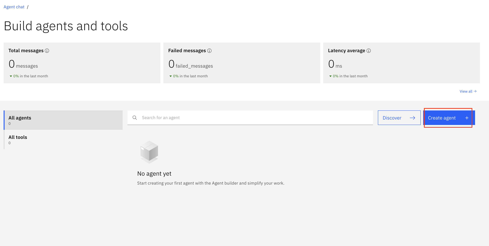

1. **처음부터 만들기**를 선택하고 에이전트 이름을 지정합니다(예: `HR Agent`). 아래와 같이 **설명**을 입력합니다:   
   - **주의사항** : 명명규칙
      - 다수의 인원이 한 자원을 사용하므로 반드시 명명규칙을 지켜 주시기 바랍니다.
      - 명명규칙 : <자기이름>_AskHR
   - 이름 (예) : 
      ```
      Juheon_AskHR
      ```
   - 설명 :

      ```
      You are an agent who handles employee HR queries.  You provide short and crisp responses, keeping the output to 200 words or less.  You can help users check their profile data, retrieve latest time off balance, update title or address, and request time off. You can also answer general questions about company benefits.
      ```  
   - **좋은 설명(Description)이란 무엇인가?**  
      설명은 에이전트의 범위를 개략적으로 제시하지만, 에이전트의 실제 동작 방식에는 영향을 주지 않는다.
      AI 모델이 사용자를 도울 적절한 에이전트를 선택할 수 있도록 하려면, 다음 요소들을 고려해야 한다:

      - **도메인 전문성(Domain expertise)**
         AI 어시스턴트가 전문적으로 다루는 도메인이나 주제를 명확히 기술한다. 도메인과 관련된 키워드를 사용한다.

      - **기능과 강점(Features and strengths)**
         AI 어시스턴트가 가진 고유한 기능과 강점을 강조하고, 사용자가 어떤 의도로 프롬프트를 입력할지 고려한다.

      - **제한사항과 범위(Limitations and scope)**
         AI 어시스턴트가 가진 한계와 지식의 범위를 정의한다. 이러한 정의는 오해를 줄이는 데 도움이 된다.

      - **명확하고 단순한 언어(Clear and simple language)**
         AI 어시스턴트의 목적과 기능을 전달할 때는 단순하고 직설적인 언어를 사용한다.

   **생성**을 클릭합니다:

   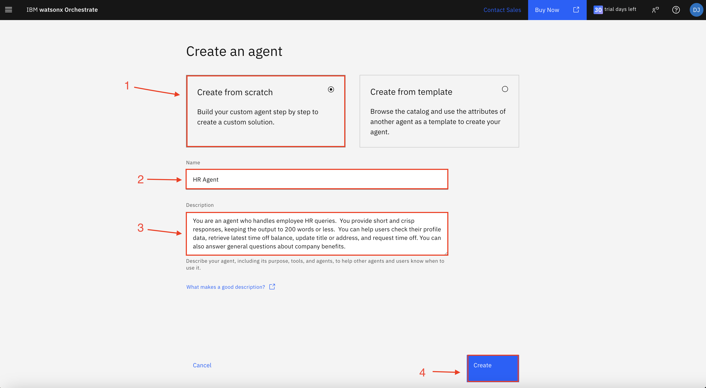
<!--   
1. Click on the down arrow against **Model**. Select Model "llama-3-405b-instruct"

   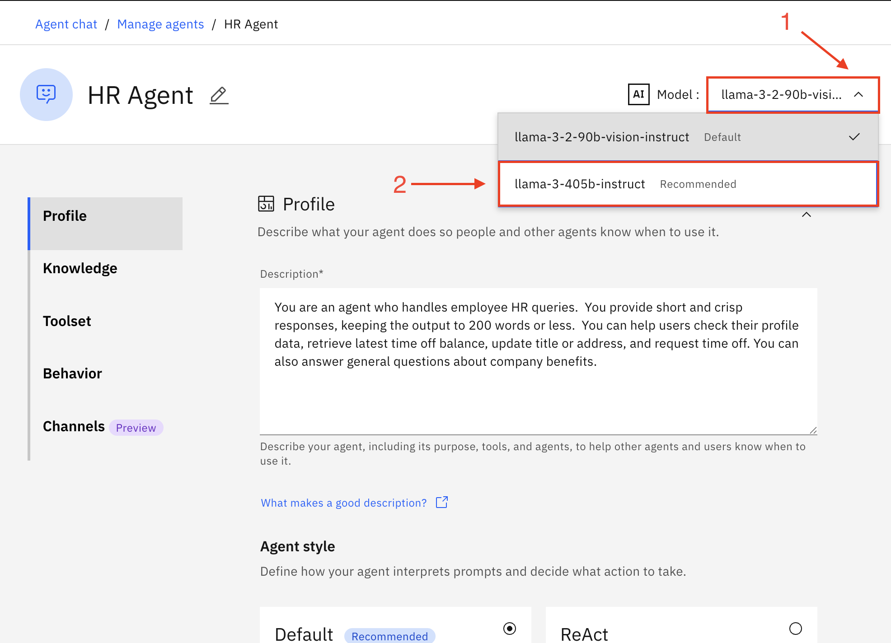
-->   
1. **에이전트 스타일** 섹션에서 **기본값**을 선택합니다.
   - **Default**
      모델이 본래 가지고 있는 이해, 계획, 도구 및 지식 호출 능력에 의존합니다.
   - **ReACt**
      모델이 과제를 완료할 때까지 생각하고, 행동하고, 관찰하며, 접근 방식을 다듬을 수 있도록 합니다.

   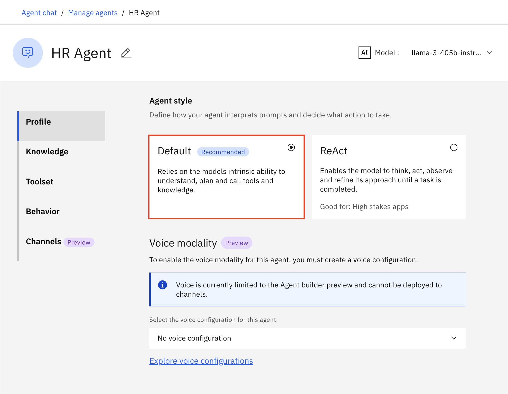
   
1. 화면을 아래로 스크롤하여 **지식** 섹션으로 이동합니다.
   **지식 선택**을 클릭합니다.
   
   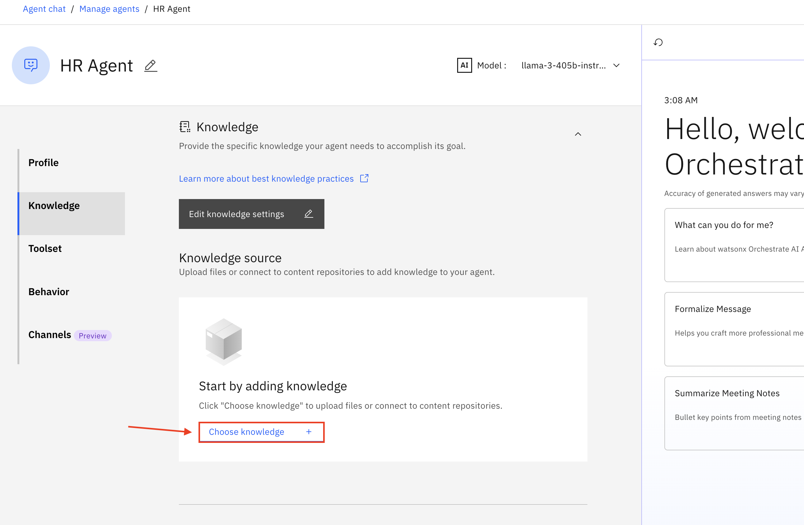
  
1. **파일 업로드**를 선택합니다.
   **다음**을 클릭합니다.
   
   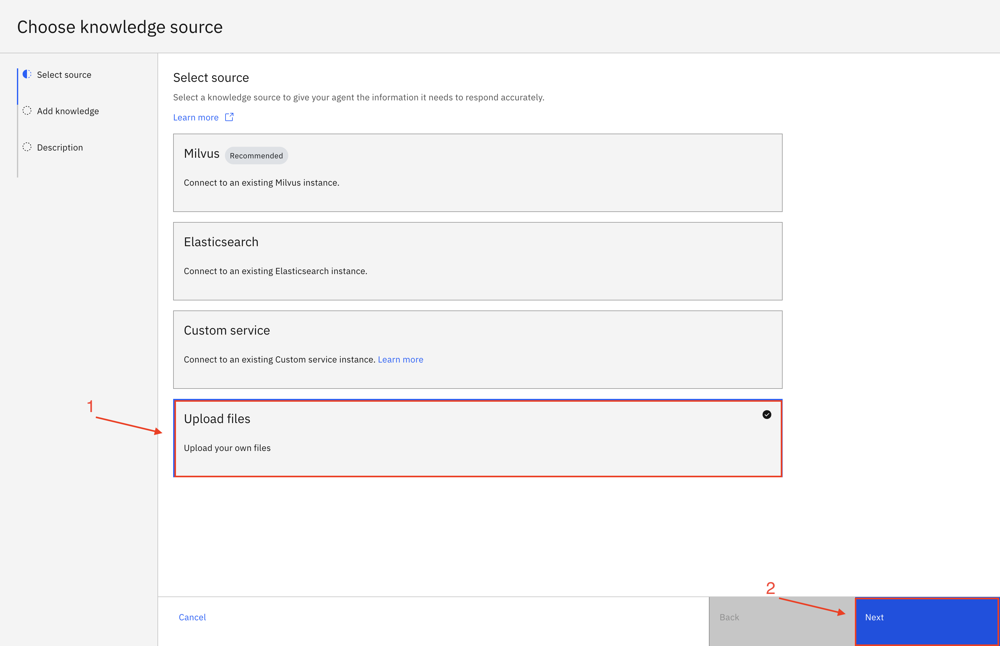
     
1. Employee Benefits.pdf를 시스템에 다운로드한 다음 여기에 파일을 업로드합니다.
   **다음**을 클릭합니다.

   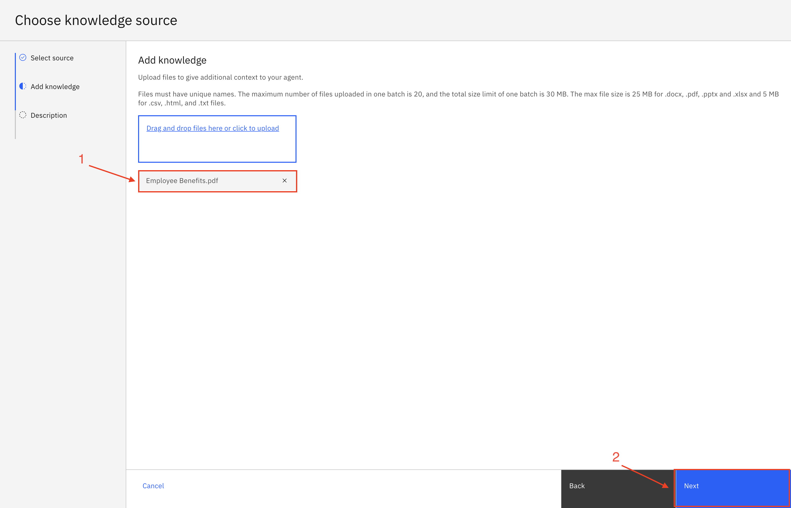

1. 다음 설명을 **설명** 섹션에 복사한 다음 **저장**을 클릭합니다:

   ```
   This knowledge base addresses the company's employee benefits, including parental leaves, pet policy, flexible work arrangements, and student loan repayment.
   ```
   - **설명(Descriptions) 이해하기**  
      에이전트의 지식 베이스에 문서를 업로드할 때는 명확하고 유익한 설명을 포함하세요. 이렇게 하면 에이전트가 데이터를 이해하고 해석하는 데 도움이 되며, 응답 시 해당 지식을 활용할지 아니면 툴 호출이나 대규모 언어 모델(LLM) 사용과 같은 다른 방법에 의존할지를 결정할 수 있습니다.
   - **효과적인 설명을 작성하는 팁**  
      **구체적으로 작성하기**: 콘텐츠 유형과 지원하는 질의 유형을 설명하세요.   
      **간단한 언어 사용하기**: 전문 용어를 피하고 문장을 간단하게 유지하세요.   
      **키워드 포함하기**: 사용자가 검색할 가능성이 높은 용어를 추가하세요.   
      **지속적으로 업데이트하기**: 콘텐츠나 기능이 발전함에 따라 설명을 수정하세요.   
   - **예**
      ```
      이 지식 베이스에는 HR 정책, 직원 핸드북, 복리후생, 휴가, 성과 관리에 관한 가이드라인이 포함되어 있습니다.  
      예를 들어 ‘육아휴직 정책은 무엇인가요?’ 또는 ‘원격 근무는 어떻게 신청하나요?’와 같은 질의에 대응할 수 있습니다.  
      키워드: 휴가 정책, 원격 근무, 복리후생, 성과 평가, 온보딩
      ```
   
   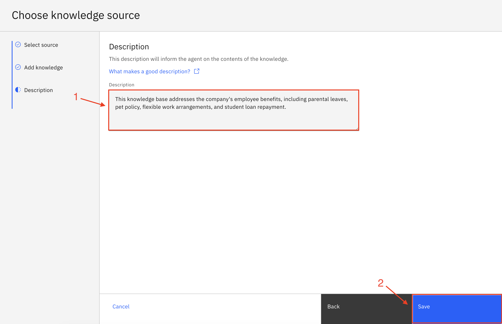

1. **도구 세트** 섹션으로 스크롤을 내립니다. **도구 추가 +**를 클릭합니다:

   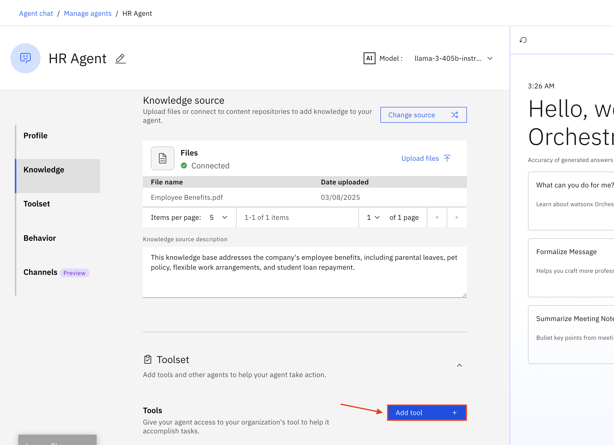

1. **가져오기**를 선택합니다:

   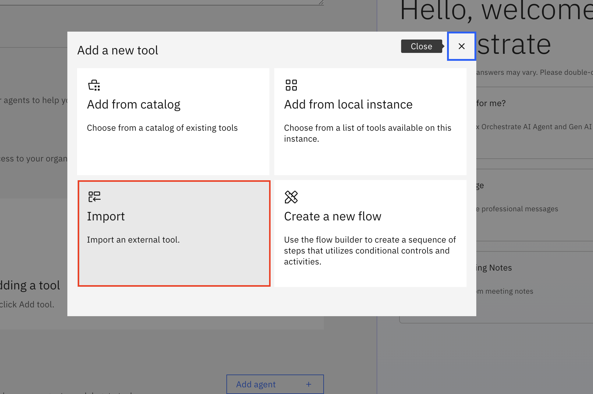

1. **파일에서 가져오기**를 선택합니다:

   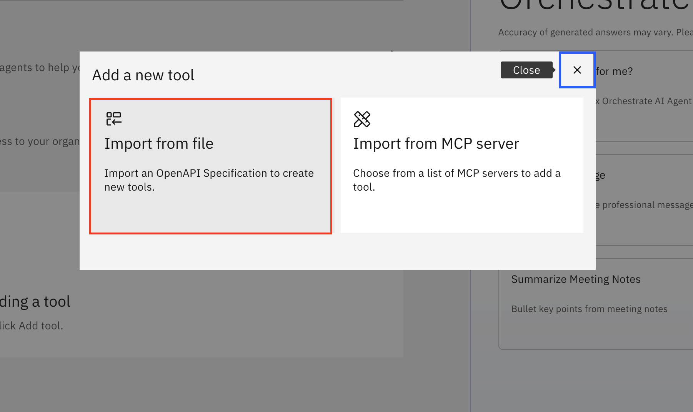

1. 강사가 제공한 **hr.yaml** 파일을 드래그 앤 드롭하거나 클릭하여 업로드한 다음 **다음**을 클릭합니다:

   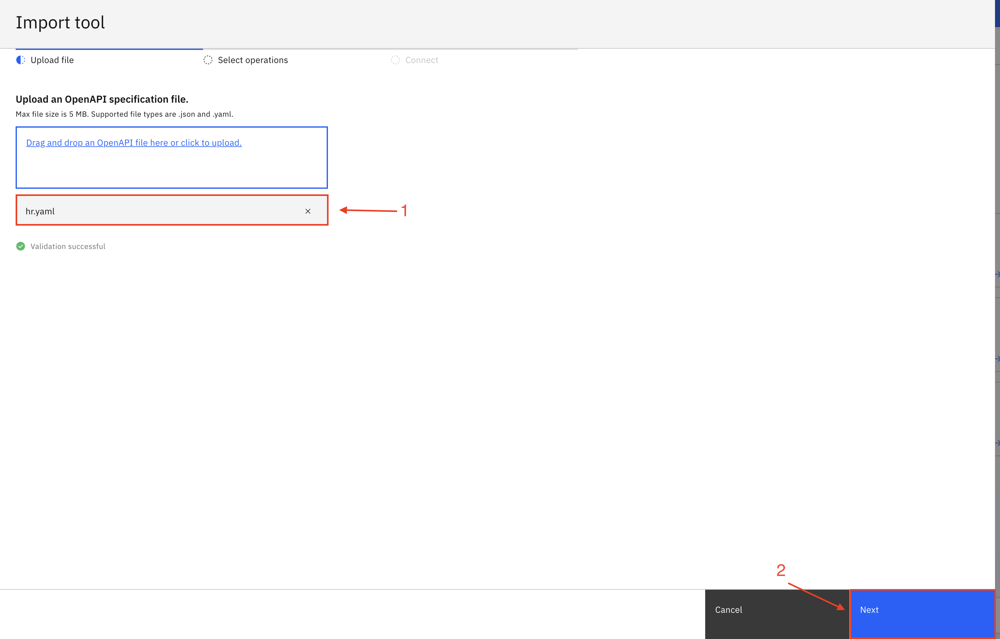    

1. 모든 작업을 선택하고 **완료**를 클릭합니다:

   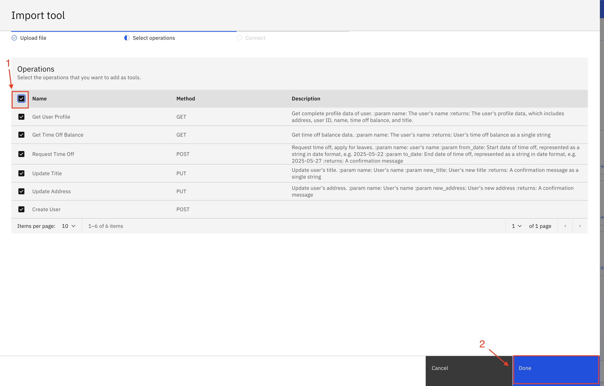

1. **동작(Behavior)** 섹션으로 스크롤을 내립니다. 아래 지침을 **지침(Instructions)** 필드에 삽입합니다:

   ```
   Use your knowledge base to answer general questions about employee benefits. 

   Use the tools to get or update user specific information.

   When user asks to show profile data or check time off balance or update title/address or request time off for the very first time,  first ask the user for their name,  then invoke the tool and then use the same name in the whole session without asking for the name again.

   When the user requests time off, convert the dates to YYYY-MM-DD format, e.g. 5/22/2025 should be converted to 2025-05-22 before passing the date to the post_request_time_off tool.
   ```
   - **동작(Behavior) 이해하기**  
      AI 에이전트의 동작은 사용자의 요청과 상황에 어떻게 반응하는지를 정의합니다.
      규칙을 설정하여 에이전트가 언제, 어떻게 행동해야 하는지를 지정할 수 있으며, 이를 통해 예측 가능하고 일관된 방식으로 작동하여 매끄러운 사용자 경험을 제공합니다.
      * 새 지침을 추가하면 기존 지침은 덮어쓰기 됩니다.
      * 변경 사항은 자동으로 저장됩니다.
      * 필드를 비워두면, 에이전트는 내장된 기본 동작만 사용합니다. (이 경우, 원하는 요구사항과 맞지 않을 수 있습니다.)
      * 지침은 모든 채널과 작업에 공통 적용됩니다. 현재는 사용자 맥락에 따라 조건부로 적용하는 기능은 지원하지 않습니다.
      * 컨텍스트 변수(Context Variables)는 사용자 맞춤형 정보를 에이전트에 전달할 수 있도록 합니다.
         이를 통해 에이전트는 개인화된 응답을 제공하거나 복잡한 작업을 실행할 수 있습니다.
         예: 이메일 ID, 위치, 회원 ID 같은 사용자별 데이터를 에이전트 동작에 활용 가능
   - **에이전트의 지침이 효과적으로 작동하는지 확인·유지하려면 다음을 수행하세요**
      * 채팅 패널에서 테스트해 새로운 동작이 어떻게 적용되는지 확인합니다.
      * 에이전트를 지원되는 채널에 연결해 실제 환경에서 응답을 평가합니다.
      * 목표나 프로세스 변화에 맞춰 지침을 정기적으로 업데이트합니다.


1. **문서와 채팅** 토글 버튼을 켭니다. **웹 채팅에 인용 표시**에서 **없음**을 선택합니다. **에이전트 표시** 토글 버튼을 켭니다. 에이전트를 배포하려면 오른쪽 상단 모서리에 있는 **배포**를 클릭합니다:

   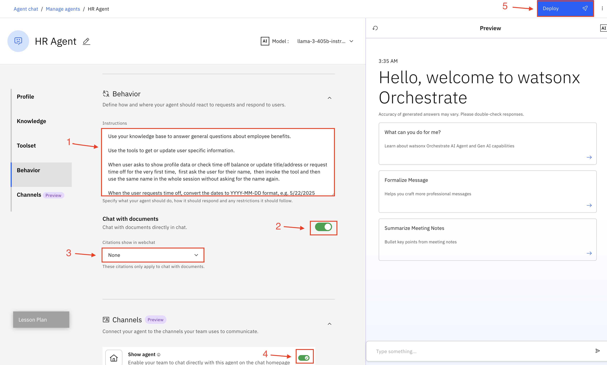

### 미리보기에서 HR 에이전트 테스트
오른쪽 미리보기 채팅에서 다음 질문을 하여 에이전트를 테스트하고 응답을 확인합니다. 아래 스크린샷에 표시된 것과 유사해야 합니다:

```
What is the pet policy? 
```
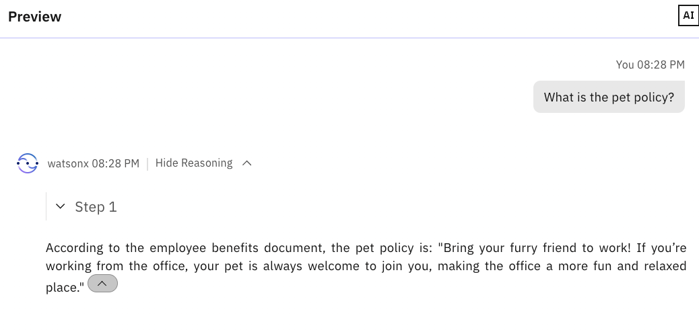

```
Show me my profile data.
```
```
Victoria Baker
```
```
I'd like to update my title. 
```
```
Sr AI Engineer
```


```
Update my address
```
```
222 Main St, San Francisco, CA 94105
```
```
What is my time off balance?
```
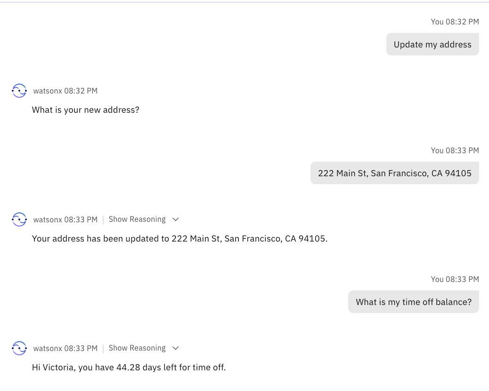

```
Request time off
```

```
Show my profile data.
```


#### HR Agent AI Chat 테스트 

AI 채팅 창에서 에이전트를 테스트합니다. 왼쪽 상단 모서리에 있는 햄버거 메뉴를 클릭한 다음 **채팅(Chat)**을 클릭합니다

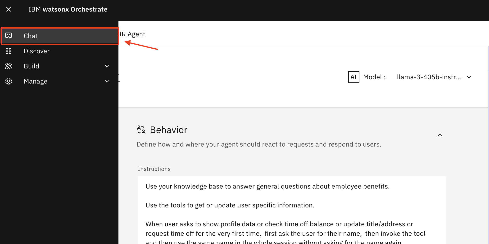

**HR Agent**가 선택되어 있는지 확인하세요. 이제 에이전트를 테스트할 수 있습니다:
- 자신이 만든 에이전트를 선택합니다. : 예) JuheonAskHR
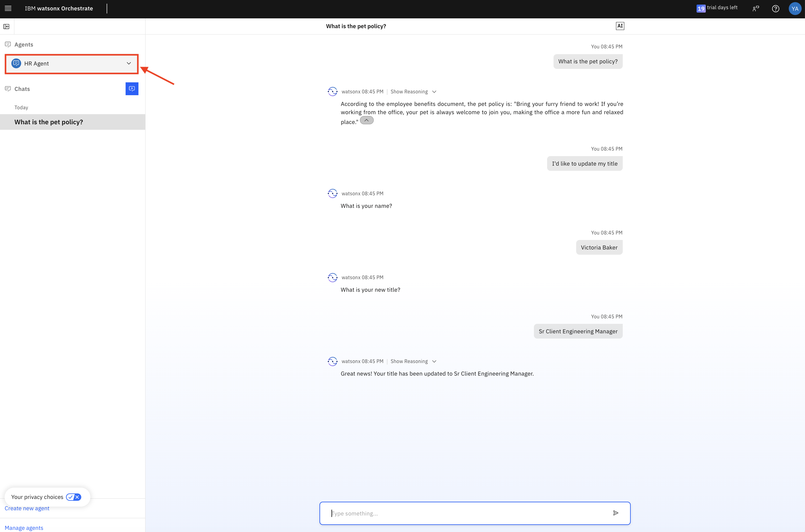
