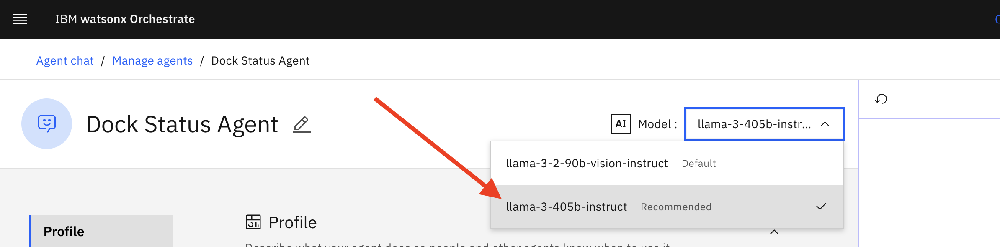
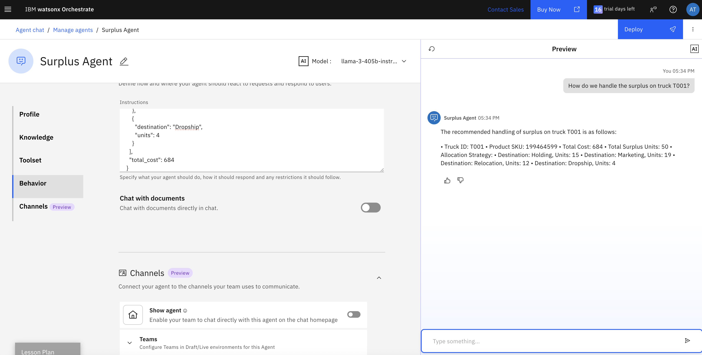

# 사용 사례: 지능형 AI 어시스턴트

## 목차

- [사용 사례: 지능형 AI 어시스턴트](#사용-사례-지능형-ai-어시스턴트)
  - [목차](#목차)
  - [소개](#소개)
    - [사전 요구 사항](#사전-요구-사항)
  - [watsonx Orchestrate](#watsonx-orchestrate)
    - [watsonx Orchestrate 콘솔](#watsonx-orchestrate-콘솔)
    - [AI 에이전트 구성](#ai-에이전트-구성)
    - [Dock 상태 에이전트(Dock Status Agent)](#dock-상태-에이전트dock-status-agent)
    - [잉여 재고 처리 에이전트(Surplus Agent)](#잉여-재고-처리-에이전트surplus-agent)
    - [비서 에이전트(Secretary Agent)](#비서-에이전트secretary-agent)
    - [교통 정보 에이전트(Traffic Agent)](#교통-정보-에이전트traffic-agent)
    - [창고 관리자 에이전트(Warehouse Manager Agent)](#창고-관리자-에이전트warehouse-manager-agent---agentic-ai-orchestration)
  - [요약](#요약)

## 소개
이 사용 사례는 사용자가 채팅 또는 자연어 인터페이스를 통해 AI 에이전트를 활용하여 각 요청을 처리할 적절한 에이전트를 선택하고 작업을 수행하도록 돕는 시나리오를 설명합니다.  
시스템 내에서 에이전트를 구성하여 조직의 특정 요구사항을 충족할 수 있습니다. 주어진 설명에 따라, 해당 작업을 수행할 수 있는 에이전트가 선택됩니다.  
각 에이전트는 함수 호출을 지원하는 대규모 언어 모델(LLM)에 연결되어 있으며, 각 도구의 설명에 따라 하나 이상의 도구를 활용할 수 있습니다.

이번 시나리오에서는 Dock 상태(Dock Status Agent), 잉여 재고 처리(Surplus Agent), 비서 기능(Secretary Agent), 교통 정보 에이전트(Traffic Agent), 창고 관리자 에이전트(Warehouse Manager Agent)를 생성하고, 모두 "라우팅 에이전트"에 연결합니다. 라우팅 에이전트는 최종 사용자의 요청을 받아 적절한 에이전트를 선택한 후 응답을 반환합니다.  
시뮬레이션되는 상호작용 흐름은 창고 관리자가 Dock 상태를 확인하고, 잉여 재고 처리에 대한 권장 사항을 요청하며, 관련 이해관계자에게 알리고, 창고 주변 교통 상황을 확인하는 과정입니다.

완전한 에이전트 솔루션은 높은 수준의 자율성을 보여줄 수 있습니다. 특정 문제를 해결하거나 요청을 처리할 때, 에이전트는 계획을 세우고 실행하며, 결과를 평가하고 필요시 계획을 수정합니다. 이는 자동으로 수행되며 인간의 개입 없이 진행됩니다. 위의 흐름에 적용하면, "사람이 개입하는 과정"을 제거하고 시스템이 Dock 상태를 분석하고, 잉여 재고 처리 방법을 결정하고, 이해관계자에게 알리고, 기록 시스템을 업데이트하도록 할 수 있습니다. 동시에 "사람이 개입하는 과정"을 유지하여, 창고 관리자가 각 단계를 실행하며 각 에이전트의 응답을 확인할 수도 있습니다.

<div style="border: 2px solid black; padding: 10px;">
이제 완전한 작동 예제를 안내하겠지만, 사용자의 실제 요구에 맞게 변경하는 것을 고려하고, 이 설명은 단지 구현을 안내하는 참조용으로 활용하시기 바랍니다.
</div>

### 사전 요구 사항

- 계속 진행하기 전에 **모든 시스템**이 정상 작동하는지 확인하세요.
- 강사가 이 실습을 진행하는 경우, **강사용 가이드**를 참조하여 모든 환경과 시스템을 설정하세요.

## watsonx Orchestrate

[솔루션 아키텍처](./images/Intelligent%20Assistant%20Architecture.jpeg)에서 보여주듯, 대부분의 에이전트를 watsonx Orchestrate에서 생성하고 배포합니다.

watsonx Orchestrate 콘솔에 접근하려면 [IBM Cloud 홈페이지의 리소스 목록](https://cloud.ibm.com/resources)으로 이동하세요.


`AI / Machine Learning` 섹션을 확장하고, Product 열에 `watsonx Orchestrate`가 있는 리소스를 선택합니다. 그런 다음 `Launch watsonx Orchestrate` 버튼을 클릭합니다.


이제 watsonx Orchestrate 콘솔이 열립니다.


### watsonx Orchestrate 콘솔

> 콘솔을 처음 열면 첫 번째 에이전트를 생성하라는 팝업이 표시될 수 있습니다. `Skip for now`를 클릭하세요.


콘솔에서는 아직 배포된 에이전트가 없음을 보여줍니다. 따라서 이 시점에서 watsonx Orchestrate와 상호작용해도 시스템이 요청을 처리할 에이전트가 없기 때문에 큰 변화는 없습니다.

하지만 이미 백그라운드에서 작동하는 LLM과 상호작용하며 "오늘 기분은 어때?" 또는 "프랑스의 수도는 어디야?"와 같은 일반 질문을 할 수 있습니다.


watsonx Orchestrate와 대화하여 어떤 답변을 제공하는지 탐색해 보세요.

### AI 에이전트 구성
이제 첫 번째 에이전트를 생성할 준비가 되었습니다. watsonx Orchestrate 콘솔에서 `Create or Deploy` 또는 `Create new agent`를 클릭합니다(둘 다 동일한 위치로 이동합니다).


### Dock 상태 에이전트(Dock Status Agent)
다음 화면에서 `Create agent`를 클릭합니다.


다음 페이지에서 새 에이전트를 처음부터 만들지, 템플릿에서 만들지 선택하고, 이름과 설명을 입력합니다.  
이번 솔루션에서는 여러 에이전트를 만들어야 하며, `Dock Status` 에이전트부터 시작합니다.  
이제 이름과 설명을 입력합니다:

**주의사항** : 명명규칙
- 다수의 인원이 한 자원을 사용하므로 반드시 명명규칙을 지켜 주시기 바랍니다.
- 명명규칙 : <자기이름>_DockStatusAgent
- 이름 (예) : 
   ```
   Juheon_DockStatusAgent
   ```
- 설명 : "생성한 에이전트명" <- 자신이 만든 에이전트 명을 작성합니다.

```
The 생성한 에이전트명 specializes in answering inquiries about current warehouse dock status. It has access to detailed and up-to-date data about which trucks are loading and unloading at docks, and information about the products they carry, and return detailed textual information about this data to the user.
```

AI 에이전트에서는 이 설명이 단순한 문서용이 아니라, 적절한 에이전트를 선택하는 결정 과정에도 사용됩니다. 따라서 이 필드에 입력하는 내용이 매우 중요합니다.


필요한 정보를 모두 입력한 후 `Create`를 클릭합니다.


다음 화면에서 새 에이전트에 대한 추가 정보를 입력할 수 있습니다.  
에이전트는 `Knowledge`, 하나 이상의 `Tools`와 `Agents`로 구성된 `Toolset`을 활용하여 요청을 처리할 수 있으며, 사용될 `AI Model`, `Agent style`, `Voice modality`를 지정할 수 있습니다.

- `Knowledge`: 벡터 스토어(Vector Store)에 "임베딩" 형태로 저장된 정보입니다.  
  에이전트가 요청에 답할 때, 연결된 Knowledge 저장소에서 정보를 검색할 수 있습니다.  
  문서를 직접 업로드하거나 기존 저장소에 연결할 수 있으며, Description 필드가 검색 여부 결정에 중요합니다.
- `Toolset`: 에이전트가 특정 작업을 위임할 수 있는 구성 요소입니다.  
  - `Tools`: 에이전트가 호출할 수 있는 기능(API 호출 또는 커스텀 코드 실행).  
    LLM 학습 범위를 넘어선 기능 확장이 가능합니다.  
  - `Agents`: 다른 에이전트(내부 또는 외부)에 요청을 위임 가능.

에이전트가 사용할 LLM과 스타일도 지정할 수 있습니다.  
이 에이전트(및 아래 다른 에이전트들)에서는 `llama-3-405b-instruct` 모델을 선택합니다.



스타일은 `ReAct`를 선택합니다.


실제 프로덕션에서는 Dock Status 에이전트가 창고 Dock의 트럭 및 제품 정보를 제공하는 기존 엔터프라이즈 백엔드 시스템 앞에 위치합니다.  
이번 실습에서는 `Behavior` 필드에 데이터를 하드코딩하여 백엔드를 시뮬레이션합니다.  
이 필드 내용은 LLM에 전달되는 프롬프트를 구성하며, 하드코딩 데이터는 프롬프트 예시 역할을 합니다.

에이전트 정의 페이지에서 `Behavior` 섹션까지 스크롤하고, `Instructions` 텍스트 필드에 다음 내용을 복사합니다:

```
Persona:
- Your purpose is to provide information about warehouse dock status. I will ask about the status at the docks, or one specific dock identified by dock ID, and you will answer in a detailed textual format.

Context:
- Use the Dock status data below to create answers. The data below is formatted in JSON, but you will return the information as text in a bulleted list.
- If no dock ID is specified, return data for all the docks.
- the data is current, no timestamp is required or supported.
- Provide as much detail as you can.

Dock status data:
[
  {
    "dock_id": 1,
    "trucks": [
      {
        "truck_id": "T001",
        "status": "Unloading",
        "ETA": "2 hours",
        "details": {
          "SKU": "199464599",
          "Payload_Quantity": 250,
          "Surplus_Status": "Received surplus"
        }
      },
      {
        "truck_id": "T002",
        "status": "Unloading",
        "ETA": "1.5 hours",
        "details": {
          "SKU": "226814212",
          "Payload_Quantity": 150,
          "Surplus_Status": "No Surplus"
        }
      },
      {
        "truck_id": "T003",
        "status": "Unloading",
        "ETA": "1 hour",
        "details": {
          "SKU": "404108299",
          "Payload_Quantity": 200,
          "Surplus_Status": "No Surplus"
        }
      }
    ]
  },
  {
    "dock_id": 2,
    "trucks": [
      {
        "truck_id": "T004",
        "status": "Unloading",
        "ETA": "1.5 hours",
        "details": {
          "SKU": "102209199",
          "Payload_Quantity": 50,
          "Surplus_Status": "Received surplus"
        }
      },
      {
        "truck_id": "T005",
        "status": "Unloading",
        "ETA": "2 hours",
        "details": {
          "SKU": "148183199",
          "Payload_Quantity": 80,
          "Surplus_Status": "No Surplus"
        }
      }
    ]
  }
]

```


마지막으로 `Show agent` 체크박스를 해제합니다.  
이 옵션은 메인 채팅 창에서 에이전트 노출 여부를 결정합니다.  
현재는 최상위 에이전트만 노출할 것입니다.


이제 새 에이전트를 테스트합니다. 미리보기 창에서 예를 들어 "Can you tell me about the status of the warehouse docks?"라고 입력합니다.  
에이전트가 제공된 데이터를 기반으로 답변하는 것을 확인할 수 있습니다.
```
Can you tell me about the status of the warehouse docks?
```


> 실제 환경에서는 스크린샷과 다른 답변이 나올 수 있으며, 경우에 따라 추가 질문이 나올 수도 있습니다.  
> 다른 질문을 시도하며 에이전트 반응을 확인해보세요. 아래 다른 모든 에이전트도 동일합니다.

상단 오른쪽의 `Deploy` 버튼을 클릭하여 에이전트를 배포합니다.


다음 페이지에서 필요한 "Connections"를 정의할 수 있습니다.  
우리 에이전트는 별도의 백엔드 연결이 필요 없으므로 비워두고 `Deploy`를 클릭합니다.


`Manage agents` 링크를 클릭하여 에이전트 목록으로 돌아갑니다.


Dock Status Agent 옆에 초록색 "Live" 아이콘이 표시되면 성공적으로 배포된 것입니다.


### 잉여 재고 처리 에이전트(Surplus Agent)

이 에이전트는 잉여 제품(surplus product) 처리 옵션을 분석하고, 처리 방법에 대한 추천을 제공합니다.  
잉여 제품은 다양한 경로로 이동될 수 있으며, 각각 다른 비용이 발생합니다.  
이전 Dock Status Agent 예제와 마찬가지로, 실제 시스템에서는 별도의 애플리케이션과 연결되지만, 이번 실습에서는 데이터를 하드코딩하여 시뮬레이션합니다.  

`Manage agents` 화면에서 `Create agent` 버튼을 클릭합니다.


`Create from scratch` 옵션을 유지하고, 이름을 "Surplus Agent"로 입력한 후 Description 필드에 다음 내용을 입력합니다:
**주의사항** : 명명규칙
- 다수의 인원이 한 자원을 사용하므로 반드시 명명규칙을 지켜 주시기 바랍니다.
- 명명규칙 : <자기이름>_SurplusAgent
- 이름 (예) : 
   ```
   Juheon_SurplusAgent
   ```
- 설명 : "생성한 에이전트명" <- 자신이 만든 에이전트 명을 작성합니다.
```
The 생성한 에이전트명 provides recommendations about the handling of surplus data. It has access to data including the allocation strategy, product SKU and total cost for the surplus on each truck, and it returns information about the recommended handling of surplus.
```


그 다음 `Create`를 클릭합니다.

다음 화면에서 `llama-3-405b-instruct` 모델을 선택하고, 에이전트 스타일을 `ReAct`로 설정합니다.  
그 후 `Behavior` 섹션으로 스크롤하여 `Instructions` 필드에 다음 내용을 입력합니다:


```
Persona:
- Your purpose is to provide information about surplus. I will ask about the recommended handling of surplus on a specific truck, and you will answer in a detailed format with the allocation strategy based on the given data, along with truck id, Product SKU, total cost, surplus unit.

Context:
- Use the Surplus data below to create answers. The data below is formatted in JSON, but you will return the information as text in a bulleted list.
- If no allocation strategy is specified, return data according to the default allocation strategy given in the data below.
- If no product SKU is provided by the user, return data for all of the product SKUs within a given truck ID.
- Provide as much detail as you can.

Surplus data:
{
  "truck_id": "T004",
  "SKU": "102209199",
  "total_surplus": 15,
  "allocation": [
    {
      "destination": "Marketing",
      "units": 12
    },
    {
      "destination": "Relocation",
      "units": 3
    }
  ],
  "total_cost": 69
},
{
  "truck_id": "T001",
  "SKU": "199464599",
  "total_surplus": 50,
  "allocation": [
    {
      "destination": "Holding",
      "units": 15
    },
    {
      "destination": "Marketing",
      "units": 19
    },
    {
      "destination": "Relocation",
      "units": 12
    },
    {
      "destination": "Dropship",
      "units": 4
    }
  ],
  "total_cost": 684
}
```


Dock Status Agent와 마찬가지로 `Show agent` 체크박스를 해제합니다.


배포 전, Preview 창에서 요청을 입력하여 기능을 테스트할 수 있습니다. 예를 들어:
```
How do we handle the surplus on truck T001?
```



결과가 만족스러우면, 상단 오른쪽의 `Deploy` 버튼을 클릭하여 에이전트를 배포합니다.  
Connections 리스트는 비워두고, `Deploy`를 다시 클릭합니다.  
그 후 `Manage agents` 링크를 클릭하여 에이전트 목록 화면으로 돌아갑니다.

이제 두 개의 에이전트가 표시되며, 모두 "Live" 상태임을 확인할 수 있습니다.


### 비서 에이전트(Secretary Agent)

이제 또 다른 에이전트를 만드는 것은 매우 쉬울 것입니다.  
이번에는 이해관계자와의 커뮤니케이션을 처리하고, 잉여 제품 처리 관련 알림을 보내는 에이전트를 만듭니다.  

지침에 사용된 이메일 예제들은 창고의 잉여 재고(surplus)를 팀별로 알리는 상황을 보여줍니다. 핵심 포인트는 유닛 개수에 따라 조치가 달라지는 것이 아니라, 팀 역할에 따라 어떤 행동을 취해야 하는지가 정해져 있다는 것입니다.

각 팀은 자신의 업무 특성에 맞게 행동 지침이 있습니다. 예를 들어, 마케팅팀은 잉여 재고가 발생하면 판촉이나 프로모션 활동을 검토하도록 하고, 보관팀(Holding Team)은 창고에 안전하게 보관해야 합니다. 출고/배송팀(Dropship Team)은 배송 일정을 조정하며, 재배치팀(Relocation Team)은 재고를 다른 위치로 옮기는 조정을 수행합니다.

모든 이메일은 일정한 형식을 따릅니다. 먼저 제목에 SKU 번호를 명시하고, 본문은 [팀 이름],으로 시작해 잉여 재고 발생 사실과 수행할 액션을 안내하며, 마지막에 Warehouse Management로 마무리됩니다.

즉, 이 예제는 **팀별 역할 기반 정책(rule-based action)**을 보여주며, 단순히 잔여 수량을 전달하는 것이 아니라, 팀이 수행해야 할 조치까지 포함해 자동으로 안내하는 구조입니다.

- **팀별 역할 기반 정책**    
    | 팀 이름 (Team)     | SKU 예제      | 잉여 유닛 (Units) | 권장 조치 (Action)              |
    | --------------- | ----------- | ------------- | --------------------------- |
    | 마케팅팀(Marketing Team)  | 223456789   | 25            | 잉여 유닛 활용을 위한 마케팅 활동 검토 및 조정 |
    | 보관팀(Holding Team)    | 112334343   | 10            | 잉여 유닛을 창고에 안전하게 보관          |
    | 출고/배송팀(Dropship Team)   | 88245464599 | 10            | 배송 일정 검토 및 필요 시 조정          |
    | 재배치팀(Relocation Team) | 765004599   | 9             | 잉여 유닛 재배치 검토 및 조정           |

   
--- 

에이전트 생성 과정은 이전 두 에이전트와 동일하며, 이번에도 `Instructions` 필드에 출력 예제를 제공하여 시뮬레이션합니다.

`Create agent`를 클릭하고 다음을 입력합니다:
**주의사항** : 명명규칙
- 다수의 인원이 한 자원을 사용하므로 반드시 명명규칙을 지켜 주시기 바랍니다.
- 명명규칙 : <자기이름>_SecretaryAgent
- 이름 (예) : 
   ```
   Juheon_SecretaryAgent
   ```
- 설명 : "생성한 에이전트명" <- 자신이 만든 에이전트 명을 작성합니다.
    ```
    The 생성한 에이전트명 specializes in creating emails related to warehouse topics. 
    ```

그 다음 `Create`를 클릭합니다.  
모델로 `llama-3-405b-instruct`를 선택하고, 에이전트 스타일은 `Default`로 유지합니다.  
`Behavior` 섹션의 `Instructions` 필드에 다음 내용을 입력합니다:

```
Persona:
- Your persona is that of a secretary that drafts emails. I will ask you to create an email about a topic, and you will return a textual draft of that email.

Context:
- Write a concise and professional draft email about the surplus in the inventory.   The email should directly begin with the subject line, followed by the email body without any introductory statements or preambles. 
- Use your knowledge of email writing as a guide to structure and tone, but do not limit yourself to specific teams or predefined examples.  
- Assume the audience and content are general unless specified otherwise.  
- Avoid mentioning any knowledge limitations or referencing specific teams unless explicitly required. 
- Below are examples of user prompts and the resulting generated email as guidance for your own generations.  

Examples:
Example1:
Input: 
Generate a notification email for the marketing team for item 223456789 for 25 units
Output:
Subject: Notification of Surplus Units for SKU# 223456789 

Marketing Team,
This email is to inform you that there are 25 surplus units of item 223456789 available. Please review and coordinate any necessary marketing efforts for these additional units.

Warehouse Management

Example2:
Input:  Generate a notification email for the holding team for item 112334343 for  10 units
Output:

Subject: Notification of Surplus Units for SKU#112334343

Holding Team,
This email is to notify you that there are 10 units of item 112334343 in surplus which need to be stored in the inventory. Please take necessary actions.

Warehouse Management

Example3:
Input:  Generate a notification email for the dropship team for SKU: 88245464599 of 10 units
Output:
Subject: Notification of Surplus Units for SKU#88245464599

Dropship Team,
This email is to notify you that there are 10 units of item 88245464599 in surplus. Please review and adjust shipping schedules as needed to accommodate these additional units.

Warehouse Management


Example 4:
Input:   Generate a notification email for the relocation team for SKU: 765004599 of 9 units
Output: 
Subject: Notification of Surplus Units for SKU#765004599

Relocation Team,
This email is to notify you that there are 9 units of item 765004599 in surplus. Please review and coordinate any necessary relocation efforts for these additional units.

Warehouse Management
```


`Show agent` 체크박스를 해제합니다.  
Preview 창에서 새 에이전트를 테스트할 수 있습니다. 마케팅팀에게 SKU: 8932464599의 10개 재고에 대한 알림 이메일을 작성해 달라는 요청할 수 있습니다.   
예를 들어 다음을 입력합니다:
```
Generate a notification email for the marketing team for SKU: 8932464599 of 10 units
```

결과는 아래 그림과 유사하게 표시됩니다.


`Deploy` 버튼을 클릭하여 에이전트를 배포한 후, 다시 `Deploy`를 클릭하고 상단 왼쪽의 `Manage agents` 링크를 클릭하여 에이전트 개요 화면으로 돌아갑니다.

---

### 교통 정보 에이전트(Traffic Agent)

거의 다 왔습니다!  
이 에이전트는 특정 위치의 최신 교통 정보를 가져와야 합니다. 이를 위해, Python 코드와 LangGraph 프레임워크를 사용하여 watsonx.ai에 배포된 에이전트에 작업을 위임합니다.  
이 에이전트의 생성 과정은 이번 실습의 범위가 아니며, 추후 별도의 실습에서 다뤄질 예정입니다.  
여기서는 강사가 사전에 배포해 둔 에이전트 정보를 제공하므로, 현재로서는 추가 작업이 필요하지 않습니다.


### 창고 관리자 에이전트(Warehouse Manager Agent) - Agentic AI Orchestration

이제 다른 모든 에이전트를 조율하고, 최종 사용자가 상호작용하는 에이전트를 생성할 준비가 되었습니다.  

`Create agent`를 다시 클릭합니다.


이전과 마찬가지로 이번 에이전트도 스크래치에서 생성하며, 이름은 **Warehouse Manager Agent**입니다.  
설명은 이전 에이전트와 달리, 이 에이전트가 '조율', '감독', '라우팅' 기능을 수행한다는 것을 나타냅니다:   

**주의사항** : 명명규칙
- 다수의 인원이 한 자원을 사용하므로 반드시 명명규칙을 지켜 주시기 바랍니다.
- 명명규칙 : <자기이름>_AskWarehouseManager
- 이름 (예) : 
   ```
   Juheon_AskWarehouseManager
   ```
- 설명 : "생성한 에이전트명" <- 자신이 만든 에이전트 명을 작성합니다.
    ```
    The 생성한 에이전트명 is in charge of routing user requests to the most relevant agent working under it.
    ```

정보 입력 후 `Create`를 클릭합니다.


모델을 `llama-3-405b-instruct`로 변경하고 에이전트 스타일을 `ReAct`로 설정합니다.


에이전트는 특정 작업을 수행하기 위해 다른 에이전트와 협업할 수 있습니다.  
이 협업 에이전트들은 에이전트 정의 화면의 `Toolset` > `Agents` 섹션에 입력합니다.


`Add agent` 버튼을 클릭합니다.  
이전 에이전트들을 협업 에이전트로 추가하려면 `Add from local instance` 옵션을 선택합니다.


이제 이전에 생성한 세 개의 에이전트가 표시됩니다.  
모두 선택한 후 `Add to agent`를 클릭합니다.  
(참고: 다른 실습에서 생성한 에이전트가 추가로 표시될 수 있으므로, 세 개의 에이전트를 정확히 선택해야 합니다.)


다시 `Add agent`를 클릭하고 이번에는 `Import` 옵션을 선택합니다.  
이를 통해 watsonx.ai에서 에이전트를 가져올 수 있습니다.


다음 화면에서 `External agent` 옵션을 선택하고 `Next`를 클릭합니다.


가져올 에이전트 정보를 입력합니다:
- **Agent details**
  - Provider: `watsonx.ai`
  - Authentication type: `API key` 유지
  - API key: <강사가 제공한 키 입력>
  - Service instance URL: <강사가 제공한 URL 입력>
- **Define new agent**
  - **주의사항** : 명명규칙
    - 다수의 인원이 한 자원을 사용하므로 반드시 명명규칙을 지켜 주시기 바랍니다.
    - 명명규칙 : <자기이름>_TrafficAgent
  - Display name (예) : (공백 불가)
    ```
    Juheon_TrafficAgent
    ```
  - 설(Description of agent capabilities) : "생성한 에이전트명" <- 자신이 만든 에이전트 명을 작성합니다.
    ```
    The 생성한 에이전트명 agent provides information about traffic in any given location.
    ```


`Import agent`를 클릭하면, 이제 Warehouse Manager Agent의 Toolset 섹션에 네 개의 에이전트가 모두 표시됩니다.


마지막으로, Warehouse Manager Agent가 위에서 정의한 협업 에이전트를 어떻게 사용할지 지침을 입력합니다.  
`Behavior` > `Instructions` 필드에 다음 내용을 입력합니다:

**주의사항** : 명명규칙
- 명명규칙에 기반하여 만든 자신의 에이전트를 사용하여 지침을 작성합니다.
- 명명규칙 (예) : 
    - Juheon_DockStatusAgent
    - Juheon_SurplusAgent
    - Juheon_SecretaryAgent
    - Juheon_TrafficAgent
```
Reasoning:
- Use the Juheon_DockStatusAgent for tasks related to dock status.
- Use the Juheon_SurplusAgent for tasks related to surplus.
- Use the Juheon_SecretaryAgent for drafting of emails.
- Use the Juheon_TrafficAgent to find traffic information about a location.
```


---

테스트 전에, 화면 하단으로 스크롤하여 `Show agent` 체크박스가 체크되어 있는지 확인합니다.  
이 에이전트는 최종 사용자가 메인 채팅 창에서 사용할 수 있어야 합니다.


테스트 예시:  
외부 TrafficAgent를 호출하여 특정 위치의 교통 정보를 확인합니다.  
Preview 텍스트 입력란에 다음을 입력합니다:  
```
Please tell me about traffic around central Sydney, Australia.
```
(물론 다른 위치를 선택해도 됩니다.)


에이전트가 요청을 처리하기 위해 "reasoning"을 수행한 것을 확인할 수 있습니다.  
Preview의 `Show reasoning` 섹션을 확장하면, 에이전트가 어떤 단계를 거쳐 요청을 처리했는지 확인할 수 있습니다.


이번 경우, 요청을 처리하기 위해 TrafficAgent를 선택했음을 알 수 있습니다.  
이는 올바른 선택이었습니다.


다른 에이전트로의 라우팅도 테스트할 수 있습니다. 이전에 개별 테스트에서 사용했던 프롬프트를 사용하세요:
```
What is the status of the warehouse docks?
```

```
How do we handle surplus on truck T001?
```

```
Please create a notification email ...
```


결과에 만족하면, 이전 에이전트와 마찬가지로 `Deploy` 버튼을 클릭하여 에이전트를 배포합니다.  
`Show agent` 옵션을 체크했으므로, 홈 화면에서 해당 에이전트를 확인할 수 있습니다.  
상단의 `watsonx Orchestrate`를 클릭합니다.


이제 메인 채팅 창에서 질문과 요청을 입력할 수 있습니다.  
왼쪽 에이전트 목록에서 Warehouse Manager Agent가 이미 선택되어 있으며, 이전에 테스트한 개별 에이전트 질문도 동일하게 사용할 수 있습니다.


여러분이 이 솔루션의 동작을 좀 더 깊이 탐구해 보길 권장합니다. 여러 에이전트가 함께 답변해야 하는 보다 “복합적인” 질문을 던져 보는 방식입니다.   
예를 들면, "창고 도크의 상태를 알려주고, 잉여 재고가 있는 경우 처리 방법도 안내해 주세요. 모든 도크 ID와 모든 제품 SKU를 확인해 주세요." 라는 복합적인 질문을 던질 수 있습니다.  

예시:  
```
Please tell me about the status of the warehouse docks and let me know what to do with surplus if there is any. Please check all dock IDs and all product SKUs.
```
에이전트가 더 구체적인 정보를 얻기 위해 후속 확인 질문을 할 수 있다는 점에 유의하세요. 예를 들어, 사용자가 어느 특정 트럭 ID에 대해 묻고 있는지 확인하는 경우가 있습니다. 이것이 보여주려는 바는, 사용자로서 에이전트에게 비교적 상세한 질문과 지시를 전달할 수 있을 뿐만 아니라, 여러 에이전트와 도구를 활용하게 함으로써 에이전트가 요청을 처리하는 방식에 더 많은 자율성을 부여할 수 있다는 점입니다.


축하합니다!  
단 한 줄의 코드도 작성하지 않고 완전한 에이전트 AI 솔루션을 생성했습니다.


## 요약

이번 실습에서는 창고 운영 관리자가 도착하는 제품과 잉여 제품을 처리하기 위해 에이전트 기반 솔루션을 사용하는 사례를 다뤘습니다.  
우리는 먼저 도크 상태 조회, 잉여 분석 등 개별 작업을 수행하는 여러 에이전트를 생성했습니다. 일부 작업에서는 watsonx.ai에서 실행되는 외부 에이전트를 가져오기도 했습니다.  
마지막으로, 모든 에이전트를 통합하는 오케스트레이팅 에이전트를 생성하여 최종 사용자가 상호작용하는 메인 프런트엔드를 완성했습니다.

설정을 마친 후, AI 에이전트 채팅을 통해 솔루션과 상호작용하면 시스템이 적절한 에이전트에게 작업을 위임하고 실행합니다.

이번 실습의 목적은 출발점을 제공하는 데 있습니다. 일부 기능은 시뮬레이션으로 처리되었으며, 실제 솔루션에서는 완전히 구현되어야 합니다. 또한, 진정한 에이전트 기반 솔루션이라면 여기서 만든 시스템 위에 **추론(reasoning) 레이어**를 추가하여 창고 상황을 자율적으로 관리하고, 스스로 결정을 내리는 계획을 수립할 수 있습니다. 이러한 솔루션은 앞으로 현실화될 가능성이 있습니다.

하지만 이번 실습을 통해 비즈니스 환경에서 AI 에이전트를 활용하는 방법에 대한 아이디어를 얻는 계기가 되었기를 바랍니다.

