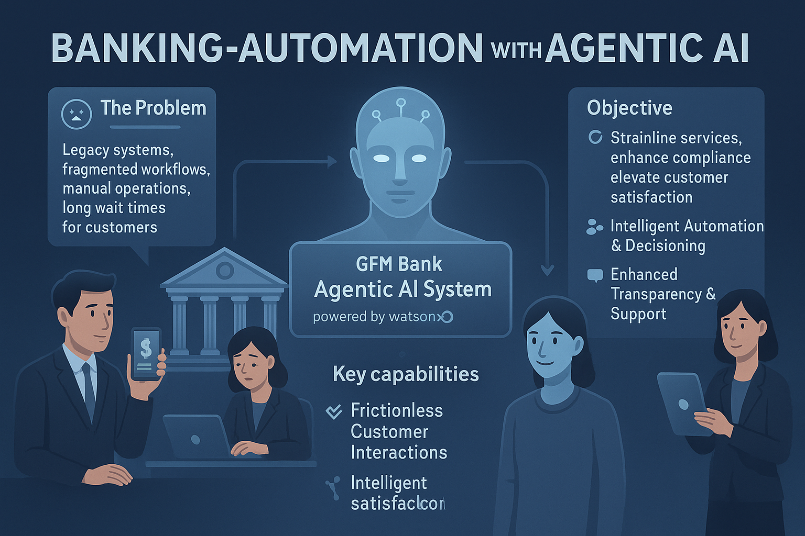
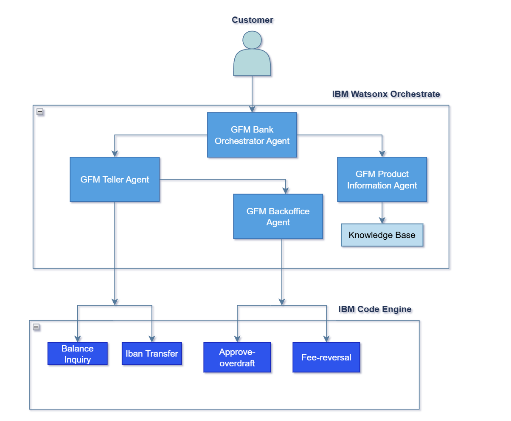

# 🏦 에이전트 AI를 활용한 은행 자동화

## 🤔 문제점
GFM 은행은 전통적이고 수동적인 은행 업무 프로세스에 의존하여 심각한 운영상의 어려움에 직면해 있습니다. 고객들은 종종 긴 대기 시간을 견뎌야 합니다. 창구 직원과 이야기하기까지 20~30분, 백오피스 승인을 받기까지 최대 45분이 더 걸립니다. 이러한 지연은 성수기나 초과 인출 승인 또는 수수료 면제와 같은 복잡한 요청 시에 특히 문제가 됩니다. 또한, 서비스는 영업 시간 중에만 제공되어 접근성과 편의성이 제한됩니다. 직원들은 반복적인 업무에 시달리며 비효율성과 일관성 없는 고객 경험을 초래합니다.

---

## 🎯 목표
**Watson Orchestrate**로 구동되는 **GFM 은행 에이전트 AI 시스템**은 지능적이고 협력적인 AI 에이전트 네트워크를 배포하여 은행 운영을 현대화하는 것을 목표로 합니다. 이 에이전트들은 일상적인 작업을 자동화하고, 복잡한 워크플로우를 간소화하며, 고객에게 빠르고 안정적인 24/7 서비스를 제공하는 동시에 은행 규정을 준수하도록 보장합니다.

### 💡 주요 기능

* **원활한 고객 상호 작용**
  
  * 잔액 조회, 이체, 초과 인출 요청 등을 위한 24/7 AI 기반 지원.
  * 복잡한 은행 업무를 통해 사용자를 안내하는 원활한 대화형 인터페이스.
    
* **지능형 자동화 및 의사 결정**

  * 계좌 내역 및 정책 규칙에 기반한 거래 및 초과 인출 요청의 자동 검증.
  * 요청을 적절한 AI 에이전트(예: 창구, 백오피스, 상품 정보)로 스마트하게 라우팅.

* **향상된 투명성 및 지원**
  
  * RAG 기반 지식 베이스를 사용하여 고객 문의에 즉각적이고 정확한 답변 제공.
  * 혼란을 줄이고 고객 신뢰도를 높이는 명확하고 안내된 워크플로우.

---

## 📈 비즈니스 가치

### 고객을 위한 가치
* 언제 어디서나 은행 서비스 이용 가능
* 신속한 거래 및 승인 처리
* 실제 지점 방문 필요성 감소
* 개인화된 대화형 은행 경험
* 초과 인출 및 수수료 면제와 같은 문제의 빠른 해결

### 은행 직원 및 운영을 위한 가치
* 수동 작업량의 상당한 감소
* 직원들이 가치가 높고 복잡한 고객 요구에 집중할 수 있는 시간 확보
* 자동화된 규정 준수 확인 및 의사 결정
* 운영 효율성 및 고객 만족도 향상
* 계절적 수요 및 고객 규모에 적응하는 확장 가능한 솔루션
---

## 🏛️ 아키텍처

---

## 📝 단계별 실습 지침

이 사용 사례를 구현하는 방법에 대한 단계별 지침은 [실습 문서](/usecases/banking-backoffice/assets/hands_on_lab_banking_automation_kr.md)에서 찾을 수 있습니다.