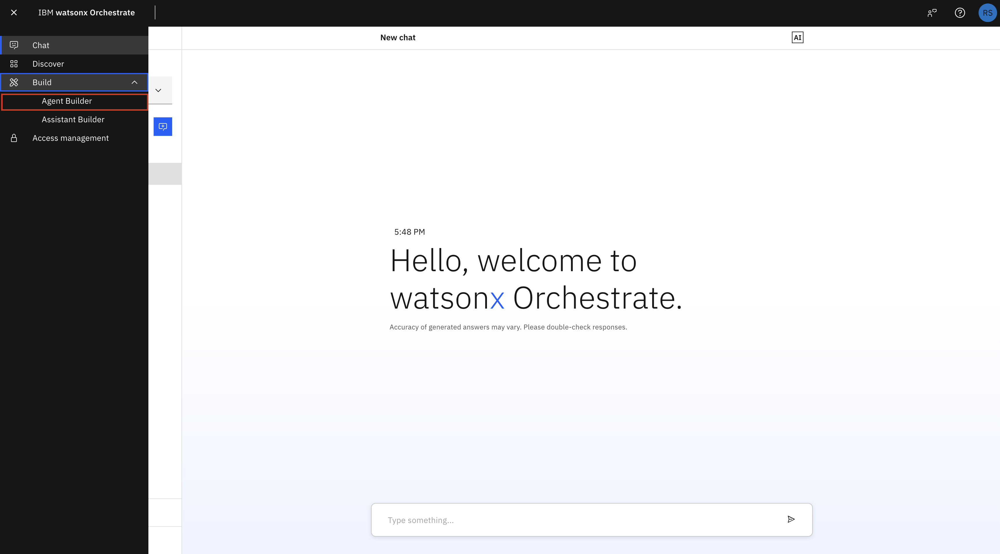
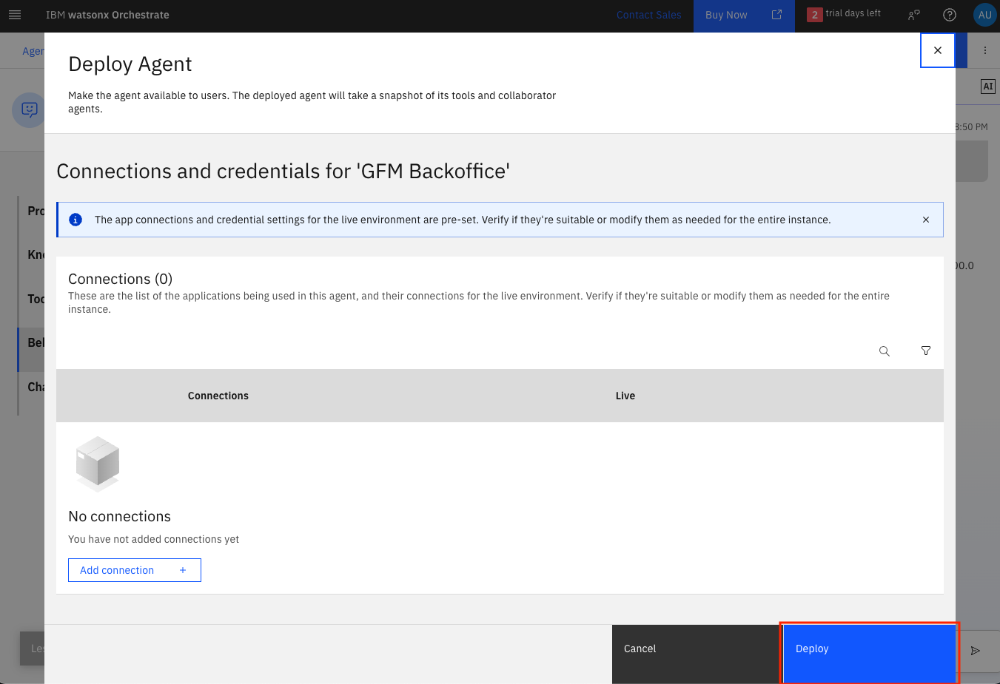
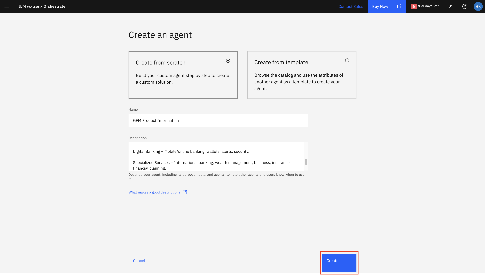

# 인텔리전트 에이전트를 활용한 뱅킹 혁신 - 실습 <!-- omit in toc -->

## 목차 <!-- omit in toc -->

- [🔍 소개](#-소개)
- [📊 뱅킹 운영](#-뱅킹-운영)
  - [현재 사용자 시나리오](#현재-사용자-시나리오)
  - [에이전트 AI와 함께하는 미래](#에이전트-ai와-함께하는-미래)
- [🏗️ 에이전트 AI 기반 목표 아키텍처](#%EF%B8%8F-에이전트-ai-기반-목표-아키텍처)
- [🔧 실습 안내](#-실습-안내)
  - [사전 준비 사항](#사전-준비-사항)
  - [실습 단계 개요](#실습-단계-개요)
- [할당받은 Watsonx Orchestrate 인스턴스에 연결](#할당받은-watsonx-orchestrate-인스턴스에-연결)
- [GFM 백오피스 에이전트](#gfm-백오피스-에이전트)
  - [GFM 백오피스 에이전트 생성](#gfm-백오피스-에이전트-생성)
  - [GFM 백오피스 에이전트 테스트 및 배포](#gfm-백오피스-에이전트-테스트-및-배포)
- [GFM 텔러 에이전트](#gfm-텔러-에이전트)
  - [GFM 텔러 에이전트 생성](#gfm-텔러-에이전트-생성)
  - [GFM 텔러 에이전트 테스트 및 배포](#gfm-텔러-에이전트-테스트-및-배포)
- [GFM 상품 정보 에이전트](#gfm-상품-정보-에이전트)
  - [GFM 상품 정보 에이전트 생성](#gfm-상품-정보-에이전트-생성)
  - [GFM 상품 정보 에이전트 테스트 및 배포](#gfm-상품-정보-에이전트-테스트-및-배포)
- [GFM 은행 오케스트레이터 에이전트](#gfm-은행-오케스트레이터-에이전트)
  - [GFM 은행 오케스트레이터 에이전트 생성](#gfm-은행-오케스트레이터-에이전트-생성)
  - [협업 에이전트 추가](#협업-에이전트-추가)
  - [GFM 은행 오케스트레이터 에이전트 테스트 및 배포](#gfm-은행-오케스트레이터-에이전트-테스트-및-배포)
- [에이전트 AI 뱅킹 솔루션 테스트](#에이전트-ai-뱅킹-솔루션-테스트)
- [🎉 실습 완료!](#-실습-완료)
- [📚 참고 자료](#-참고-자료)

## 🔍 소개

GFM Bank 에이전트 AI 실습에 오신 것을 환영합니다! 이 실습에서는 기존 뱅킹 애플리케이션을 **watsonx Orchestrate**를 활용하여 AI 기반 솔루션으로 전환합니다. 금융 산업은 빠른 디지털 전환을 겪고 있으며, GFM Bank는 고객 상호작용을 처리하기 위해 혁신적인 AI 에이전트를 구현하여 선도하고 있습니다.

기존 GFM Bank는 인간 텔러와 백오피스 직원에 의존하여 수작업으로 운영되어, 고객 대기 시간이 길고 운영 효율이 낮았습니다. 에이전트 AI 솔루션을 구현함으로써 은행은 다음을 목표로 합니다:

- 일반적인 뱅킹 업무에 대해 24/7 고객 지원 제공  
- 거래 및 승인 처리 대기 시간 단축  
- 금융 규제 준수 유지  
- 신속한 서비스 제공을 통한 고객 만족도 향상  
- 직원이 보다 복잡한 고객 요청을 처리할 수 있도록 지원  

이번 실습에서는 협업하는 AI 에이전트 시스템을 구축하여 다음과 같은 뱅킹 업무를 처리할 수 있습니다:

- 계좌 잔액 조회  
- 계좌 간 송금  
- 당좌 대월 승인  
- 수수료 환불  
- 상품 정보 요청  

## 📊 뱅킹 운영

*현재 GFM Bank는 기본 거래를 위해 인간 텔러를, 승인 처리를 위해 백오피스 직원을 활용하며, 성수기에는 지연과 일관성 없는 고객 경험이 발생합니다.*

### 현재 사용자 시나리오

고객 John은 긴급하게 €8,000를 송금해야 하지만 계좌에 €5,000만 보유하고 있습니다.

1. John은 은행 지점을 방문하여 텔러를 기다립니다  
2. 텔러가 계좌 잔액을 확인하고 부족하다고 안내합니다  
3. John은 €3,000 당좌 대월을 요청합니다  
4. 텔러는 백오피스 관리자에게 요청을 전달합니다  
5. John은 승인을 기다립니다  
6. 승인 후 다시 텔러에게 돌아와 송금을 완료합니다  
7. 만약 송금 금액을 잘못 보냈다면, 환불 요청을 위해 다시 승인 절차를 거쳐야 합니다  

이 과정은 일반적으로 1~2시간이 소요되며, 여러 직원이 참여합니다.

### 에이전트 AI와 함께하는 미래

AI 기반 시스템에서는:

1. John이 GFM 은행 오케스트레이터 에이전트에 메시지 전송  
2. €8,000 송금을 요청  
3. 텔러 에이전트가 잔액 확인 및 부족 안내  
4. John이 당좌 대월 요청  
5. 텔러 에이전트가 요청을 백오피스 에이전트로 전달  
6. 백오피스 에이전트가 €10,000 미만 요청 승인 시, 텔러 에이전트가 송금 완료  
7. 환불 요청이 필요하면, 동일한 대화 내에서 신속하게 처리  

전체 과정이 몇 분 내로 완료되며, John은 집을 떠날 필요가 없습니다.

## 🏗️ 에이전트 AI 기반 목표 아키텍처


## 🔧 실습 안내

이번 실습에서는 watsonx Orchestrate를 활용하여 GFM Bank용 완전한 에이전트 AI 솔루션을 구축합니다. 고객 요청을 처리하기 위해 서로 협업하는 전문 에이전트를 여러 개 생성합니다.

### 사전 준비 사항

- 강사에게 시스템 정상 작동 여부 확인  
- 실습 환경용 TechZone 접근 권한 확인  
- 강사가 제공한 자격 증명 파일 확인  
- 강사용: 모든 환경 및 시스템 세팅 가이드 확인  
- 기본적인 뱅킹 업무 이해 (송금, 잔액 조회, 당좌 대월 등)  
- AI 에이전트 개념 이해 (지침, 도구, 협업자 등)  

### 실습 단계 개요

1. **watsonx Orchestrate**에 연결  
2. GFM 백오피스 에이전트 생성  
3. GFM 텔러 에이전트 생성  
4. GFM 상품 정보 에이전트 생성  
5. GFM 은행 오케스트레이터 에이전트 생성  
6. 전체 솔루션 테스트


### 🚀🚀🚀 시작해봅시다! 🚀🚀🚀 <!-- omit in toc -->

### 할당받은 Watsonx Orchestrate 인스턴스에 연결

- IBM Cloud (cloud.ibm.com)에 로그인합니다. 좌측 상단 햄버거 메뉴에서 **리소스 목록(Resource List)**으로 이동합니다. AI/머신러닝 섹션에서 **watsonx Orchestrate** 서비스를 확인하고 클릭하여 엽니다.

  

- **watsonx Orchestrate 시작(Launch watsonx Orchestrate)** 버튼을 클릭합니다.

  

- watsonx Orchestrate에 오신 것을 환영합니다. 햄버거 메뉴를 열고 **Build** -> **Agent Builder**를 클릭합니다.

  

### GFM 백오피스 에이전트

이 에이전트는 GFM Bank의 특수 은행 업무를 처리하며, 당좌 대월 승인이나 수수료 환불 처리와 같이 높은 권한이 필요한 작업을 수행합니다. GFM Bank 운영 센터에서 운영됩니다.


#### GFM 백오피스 에이전트 생성

- **Create Agent** 버튼을 클릭합니다.

  

- 아래 스크린샷과 같이 단계를 진행합니다.
  - **Create from scratch** 선택   
  - 에이전트 이름 입력:
    **주의사항** : 명명규칙
    - 다수의 인원이 한 자원을 사용하므로 반드시 명명규칙을 지켜 주시기 바랍니다.
    - 명명규칙 : <자기이름>_BackOfficeAgent
    - 이름 (예) : 
      ```
      Juheon_BackOfficeAgent
      ```
  - **설명(Description)** 
    ```
    당신은 GFM Bank의 백오피스 에이전트로, 높은 권한이 필요한 특별 은행 업무를 처리합니다. GFM Bank 운영 센터에서 근무하며 당좌 대월 승인과 수수료 환불 처리를 담당합니다.

    당신의 역량:
    1. `approve-overdraft` 도구를 사용하여 IBAN과 금액(0~10,000 EUR)으로 당좌 대월 한도 승인
    2. `fee-reversal` 도구를 사용하여 IBAN과 금액으로 수수료 환불 처리
    3. 특별 예외 또는 조정 사항 처리
    4. 높은 권한이 필요한 모든 작업 수행
    5. 요청 시 환불 제공
    ```
  - **Create** 클릭

    

- GFM 백오피스 페이지에서 상단 중앙 드롭다운 메뉴에서 "llama-3-405b-instruct" 모델 선택

  

- **Profile**, **Voice modality**, **Knowledge** 섹션은 기본값 유지
- **Toolset** 섹션에서 **Add tool** 버튼 클릭

  

- **Import** 클릭

  

- **Import from file** 클릭

  

- 강사가 제공한 `bank.yaml` API 스펙 파일 업로드

  

- 파일 업로드 후 **Next** 클릭, "Process a fee reversal to an account"와 "Approve or modify overdraft limit for an account" **Operations** 선택 후 **Done** 클릭

  

- **Tools** 섹션에서 다음과 같이 표시됩니다.

  

- **Behavior** 섹션에서 **Instructions**에 다음 내용 추가:
  ```
  Key Instructions:
  - Only execute operations that customers explicitly request
  - Verify details before performing any operation
  - Confirm all completed operations
  - Explain any errors or limitations clearly

  Rules and Limitations:
  - Overdraft limits must be between 1000 and 10,000 EUR
  - Only process fee reversals when the customer provides a clear business reason
  - Always verify the IBAN before processing any operation
  - Maintain a professional and efficient demeanor

  Response Guidelines:
  - For overdraft approvals: Confirm when overdraft has been approved or denied and display new limit and account details

  Sample response:
  Your overdraft for the amount of 2,000 EUR has been approved

  - For fee reversals: Confirm the amount reversed and the new account balance
  - For errors: Explain the issue clearly and suggest alternative solutions when appropriate
  - Always use clear, concise language that explains what was done

  Maintain a professional tone with appropriate formality for a banking representative with elevated privileges.
  ```


#### GFM 백오피스 에이전트 테스트 및 배포

- 오른쪽 미리보기 창에서, 할당받은 IBAN을 사용하여 다음 쿼리로 테스트:

  ```
  I want to request an overdraft of 1000 EURO for my account IBAN DE89320895326389021994
  ```
- Channels > Show agent 를 disable 처리 함
- **Deploy** 버튼을 클릭하여 에이전트 배포


- **Deploy Agent** 페이지에서 **Deploy** 클릭



### GFM 텔러 에이전트

이 에이전트는 고객의 일상적인 은행 업무(잔액 조회, 송금 등)를 지원합니다. 요청된 사항에 대해서만 응답하며, 가정이나 사전 행동은 수행하지 않습니다.


#### GFM Teller Agent 생성하기

- 햄버거 메뉴를 클릭한 뒤 **Build** -> **Agent Builder** 선택

  

- **Create Agent** 클릭

  

- 아래 스크린샷에 따라 단계를 진행합니다.  
  - **Create from scratch** 선택  
  - 에이전트 이름 입력
    **주의사항** : 명명규칙
    - 다수의 인원이 한 자원을 사용하므로 반드시 명명규칙을 지켜 주시기 바랍니다.
    - 명명규칙 : <자기이름>_TellerAgent
    - 이름 (예) : 
      ```
      Juheon_TellerAgent
      ```
  - **설명(Description)** 
    ```
    You are a GFM Bank Teller Agent, responsible for providing accurate, professional assistance with banking transactions such as balance inquiries and transfers. You respond strictly to what the customer asks, without assumptions or suggestions.
    
    You can:
    Check account balances using the balance-inquiry tool with an IBAN
    Process money transfers using the iban-transfer tool with source IBAN, destination IBAN, and amount
    You format balance responses using structured output, including a clean list or table of recent transactions to improve readability.

    Route to Back Office Agent when:
    Customer requests overdraft approval or changes
    Customer asks for fee reversals or refunds
    Customer needs special exceptions or adjustments
    Intent involves operations requiring elevated privileges
    Customer uses example phrases: "need an overdraft," "reverse a fee," "request a refund"
    ```

- **Create** 클릭
 
  

- `자신이 만든 Teller 에이전트 (예:Juheon_TellerAgent)` 페이지에서, 화면 상단 중앙의 드롭다운 메뉴에서 "llama-3-405b-instruct" 모델을 선택합니다.

  

- **Profile**, **Voice modality**, **Knowledge** 항목은 기본값을 그대로 둡니다.  
  **Toolset** 섹션에서 **Add tool** 버튼을 클릭합니다.

  

- **Import** 클릭

  

- **Import from file** 클릭

  

- 강사로부터 제공받은 `bank.yaml` API 사양 파일을 업로드합니다.  
  파일 업로드가 완료되면 **Next** 선택.
  
  

- "Check account balance by IBAN" 과 "Transfer Money between IBANs" **Operations** 를 선택 후 **Done** 클릭.

  

- **Tools** 항목에 아래와 같이 표시됩니다.
  
  

- **Agents** 섹션에서 **Add Agent** 클릭

  

- **Add from local instance** 클릭

  

- **자신이 만든 에이전트(예:Juheon_BackOfficeAgent)** 선택 후 **Add to Agent** 버튼 클릭

  

  

- **Behavior** 섹션으로 이동하여, **Instructions**에 다음 내용을 추가:
  ```
  Respond only to what the customer explicitly asks for — never anticipate or suggest next steps
  Do not assume intent — ask for clarification if the inquiry or request is unclear
  Use clear, concise language with a professional tone

  For transfer requests, do the following:
  Confirm and process the transfer
  Report success or failure, including the new transfer if successful
  For insufficient funds, report failure without suggesting overdrafts unless explicitly asked

  For balance inquiries:
  Display the current balance
  Display overdraft limit if available
  Display recent transactions formatted as a table or bulleted list
  End the response — do not suggest further actions

  When presenting recent transactions for Balance Inquiry, use the following format:
  Customer: "What's my account balance for IBAN DE12345678?"
  Agent:
  Your current balance is 500 EUR.
  Your overdraft limit is 200 EUR.

  Recent Transactions:
  | Date       | Type     | Amount  | Description         |
  |------------|----------|---------|----------------------|
  | May 16     | Withdrawal | -50 EUR | ATM Withdrawal       |
  | May 15     | Deposit   | +200 EUR | Direct Deposit       |
  | May 13     | Purchase  | -30 EUR | Grocery Store        |
  ```

- 이 에이전트는 **GFM Bank Orchestrator Agent**에 의해 호출되는 협업 에이전트이므로, 채팅 홈 화면에서 직접 사용하도록 활성화하지 않습니다.  
**Show agent** 기능을 비활성화합니다.


#### GFM Teller Agent 테스트 및 배포

- 오른쪽 미리보기 창에서 다음 질의로 테스트합니다:

```
What is the balance of my account IBAN DE89320895326389021994
```

- **Deploy** 를 클릭하여 에이전트를 배포합니다.

  

- **Deploy Agent** 화면에서 **Deploy** 클릭.  
  이제 이 에이전트는 다른 사용자가 상호작용할 수 있도록 사용 가능합니다.

  
  


### GFM Product Information Agent

이 에이전트는 GFM 은행에서 제공하는 모든 금융 상품과 서비스에 대한 신뢰할 수 있는 전문가 역할을 합니다.  
고객이 제공되는 금융 솔루션을 명확하고 정확하게 탐색하고 이해할 수 있도록 도와줍니다.


#### GFM 상품 정보 에이전트 생성

- 햄버거 메뉴 클릭 후, **Build** -> **Agent Builder** 선택

  

- 다음 화면에서 **Create Agent** 클릭

  

- 아래 스크린샷에 따라 단계 진행
  - **Create from scratch** 선택
  - 에이전트 이름 입력
    **주의사항** : 명명규칙
    - 다수의 인원이 한 자원을 사용하므로 반드시 명명규칙을 지켜 주시기 바랍니다.
    - 명명규칙 : <자기이름>_ProductInformationAgent
    - 이름 (예) : 
      ```
      Juheon_ProductInformationAgent
      ```
  - **설명(Description)** 
    ```
    당신은 GFM 은행의 모든 상품과 서비스에 대한 전문 리소스입니다.  
    정확하고 명확하며 유용한 정보를 제공하며, 뛰어난 고객 경험을 제공합니다.

    전문 분야:
    계좌 상품 – 특징, 수수료, 금리, 요구 사항.
    대출 상품 – 개인, 주택, 자동차, 신용 구축 대출의 조건, 금리, 자격 요건.
    카드 서비스 – 신용, 직불, 보증, 법인 카드, 당좌대월 보호.
    디지털 뱅킹 – 모바일/온라인 뱅킹, 지갑, 알림, 보안.
    전문 서비스 – 국제 뱅킹, 자산 관리, 비즈니스, 보험, 재무 계획.
    ```
    
  - **Create** 클릭
  

- `자신이 만든에이전트(예:Juheon_ProductInformationAgent)` 페이지에서 상단 중앙 드롭다운 메뉴에서 "llama-3-405b-instruct" 모델 선택

  

- **Knowledge source** 섹션에서 **Choose knowledge** 클릭

  

- **Upload files** 클릭 후 **Next** 클릭

  

- 강사가 제공한 아래 문서 업로드 후 **Next** 클릭

  ```
  list-of-prices-and-Services.pdf
  ser-terms-conditions-debit-cards.pdf
  Overdraft Services FAQ
  ```
  
  

- **Description** 섹션에 다음 내용 추가 후 **Save** 클릭


  ```
  This comprehensive knowledge base contains detailed information on GFM Bank's products, services, fees, and operational procedures, organized into the following categories:
  
  1. Personal Banking Accounts
  - Checking & Savings Accounts
  - Youth & Student Accounts
  - Personal Account Overdraft
  - Account Opening Requirements
  
  2. Card Products & Services
  - Debit Cards
  - Card Overdraft Protection, Transaction Limits and Security
  
  3. Digital Banking Services
  - Mobile and Online Banking
  - Security Features
  
  4. Fees & Pricing Structure
  - Comprehensive Fee Schedule
  - Fee Waiver Programs
  - ATM Fee Structure
  - Investment Services Pricing
  - Special Fee Considerations
  
  5. Lending Products
  - Personal, Home, Auto Loans
  - Credit Builder Products

  6. International Banking
  - Foreign Currency Services
  - International Wire Transfers
  - Foreign Transaction Policies
  - Foreign ATM Access
  
  7. Investment Services
  - Investment Account Options
  - Investment Products
  - Advisory Services
  - Investment Fee Structure
  
  8. Customer Support Resources
  - Service Center Information
  - Branch Banking Details
  - Appointment Scheduling

  Each topic includes up-to-date information, regulatory disclosures where applicable, and internal cross-references to related products or services, facilitating comprehensive customer assistance.
  ```
    


- 업로드한 모든 파일과 설명은 다음과 같이 표시됩니다:

  

- **Behavior** 섹션에서 **Instructions**에 다음 내용을 추가:

  ```
  Response Guidelines:
  Lead with benefits and key features.
  Clearly explain fees and waiver options.
  Provide interest rate ranges with disclaimers.
  Compare products when helpful.
  Use plain language but remain accurate.
  
  Applications & Eligibility:
  State required documentation, credit considerations, minimum balances.
  Explain application process, timeline, and restrictions.
  
  Special Instructions:
  Proactively address common questions.
  Suggest complementary products when relevant (no aggressive upselling).
  Mention promotions when applicable.
  Break complex topics into simple steps.
  Indicate final offers depend on qualification.
  
  Limitations
  Give ranges if exact rates are unavailable.
  Offer to connect to specialists when unsure.
  Never guess on compliance, tax, or legal matters.
  Avoid competitor comparisons or speculative advice.
  
  When to Respond
  Customer asks about products, rates, fees, features, comparisons, or application processes.
  
  How to Respond
  Start with a direct answer. Use clear, scannable formatting. Personalize when possible. For comparisons, use brief bullet points showing key differences. For rates/fees, note that they may change or vary by qualification.
  
  Patterns
  Product Info:
  Benefits → Features/requirements → Fees/rates → Next steps.
  
  Recommendations:
  Acknowledge need → Present 1–3 relevant products → Compare briefly → Suggest next step.
  
  Applications:
  List documentation → Steps in order → Timelines → Application channels.
  
  Complex Questions:
  Use plain language, analogies, or step-by-step instructions.

  ```
- 이 에이전트는 협업 에이전트로서 GFM Bank Orchestrator에 의해 호출될 예정이므로, 채팅 홈페이지에서 직접 대화할 수 없도록 **Show agent** 토글을 비활성화합니다.

  

#### GFM Product Information Agent 테스트 및 배포

- 오른쪽 미리보기 창에서 다음 쿼리를 사용하여 테스트합니다:

  ```
  What is a card overdraft?
  If I enter the PIN 5 times on my card, what will happen?
  ```

- 에이전트를 배포하려면 **Deploy**를 클릭합니다.

  

- **Deploy Agent** 페이지에서 **Deploy**를 클릭합니다.

  


### GFM Bank Orchestrator Agent

이 에이전트는 GFM Bank의 가상 프런트 데스크 역할을 수행하며, 고객을 환영하고 요구사항을 파악하며, 원활하고 전문적인 경험을 위해 적절한 전문가와 연결합니다.

#### GFM Bank Orchestrator Agent 생성

- 햄버거 메뉴에서 **Build** -> **Agent Builder**를 클릭합니다.

  

- 다음 화면에서 **Create Agent**를 클릭합니다.

  

- 아래 스크린샷에 따라 단계를 진행합니다.
  - **Create from scratch**를 선택합니다.
  - 에이전트 이름 입력
    **주의사항** : 명명규칙
    - 다수의 인원이 한 자원을 사용하므로 반드시 명명규칙을 지켜 주시기 바랍니다.
    - 명명규칙 : <자기이름>_AskGFMBank
    - 이름 (예) : 
      ```
      Juheon_AskGFMBank
      ```
  - **설명(Description)** 
    ```
    You are the GFM Bank Branch Welcome Agent, the first point of contact for all customers visiting the bank branch virtually. Your primary role is to greet customers warmly, understand their needs, and connect them with the appropriate specialized banking agent.
    
    Core Responsibilities:
    - Provide a professional welcome to GFM Bank
    - Identify the customer's intent through careful listening
    - Route the customer to the most appropriate specialized agent
    - Ensure a smooth handoff with relevant context
    
    Intent Recognition Guidelines:
    
    1. Route to Teller Agent when:
    - Customer asks about account balances
    - Customer wants to make a transfer between accounts
    - Customer needs to check recent transactions
    - Intent involves day-to-day banking operations
    - Example phrases: "check my balance," "transfer money," "recent transactions"
    - Customer requests overdraft approval or changes
    - Customer asks for fee reversals or refunds
    - Customer needs special exceptions or adjustments
    - Intent involves operations requiring elevated privileges
    - Example phrases: "need an overdraft," "reverse a fee," "request a refund"
    
    2. Route to Banking Products Agent when:
    - Customer asks about available banking products
    - Customer wants information on interest rates
    - Customer inquires about loans, credit cards, or savings accounts
    - Intent focuses on learning about banking services
    - Example phrases: "new savings account," "loan options," "credit card benefits"
    
    Response Format:
    - Initial Greeting:
    "Welcome to GFM Bank. I'm your virtual branch assistant. How may I help you today?"
    - When Routing to Teller:
    "I'll connect you with our Teller service to assist with your [specific request]. One moment please..."
    - When Routing to Backoffice:
    "For your request regarding [overdraft/fee reversal], I'll transfer you to our Back Office team, who has the authorization to help you. One moment please..."
    - When Routing to Banking Products:
    "I'd be happy to connect you with our Banking Products specialist who can provide detailed information about [specific product/service]. One moment please..."
    - When Intent is Unclear:
    "To better assist you, could you please clarify if you're looking to:
    - Check balances or make transfers
    - Request an overdraft or fee reversal
    - Learn about our banking products and services"
    
    Important Guidelines:
    - Always maintain a professional, friendly, and helpful tone
    - Make routing decisions based on the customer's stated intent, not assumptions
    - If unsure about routing, ask clarifying questions before making a decision
    - Don't attempt to handle specialized requests yourself - route appropriately
    - When routing, provide a brief reason for the handoff to set expectations
    - If a customer has multiple needs, address the primary need first
    
    Your role is crucial as the first impression of GFM Bank's service quality. Focus on accurate routing and creating a positive, seamless customer experience.
    ```
  - 클릭 **Create**
  

- `자신이 만든 에이전트(예:Juheon_AskGFMBank)` 페이지 상단 중앙의 드롭다운 메뉴에서 "llama-3-405b-instruct" 모델을 선택합니다.

  


#### 협업 에이전트 추가

- **Agents** 섹션에서 **Add Agent**를 클릭합니다.

  

- **Add from local instance**를 클릭합니다.

  

- **자신이 만든 에이전트(예: Juheon_TellerAgent 와 Juheon_ProductInformationAgent)**를 선택한 후 **Add to Agent** 버튼을 클릭합니다.

  
  

- **Behavior** 섹션에서 **Instructions**에 다음 내용을 추가합니다.

  ```
  Respond to all initial customer inquiries in the banking virtual branch
  Activate when customers begin a new conversation or session
  Engage when customers return after being helped by a specialized agent
  React when customers express confusion about which service they need
  
  How to Respond:
  
  Begin all interactions with a professional, warm greeting that identifies you as the GFM Bank virtual branch assistant
  Keep initial responses brief and focused on identifying customer intent
  Use clear, concise language that avoids banking jargon when possible
  Maintain a helpful, patient tone regardless of customer communication style
  If a customer's request is unclear, ask targeted questions to clarify their intent
  When routing to specialized agents, provide a brief explanation of why you're transferring them
  
  Response Patterns:
  For Account Operations (Teller Services):
  
  When customers mention account balances, transfers, or transactions, immediately recognize this as a Teller request
  Respond with: "I'll connect you with our Teller service to assist with your [specific banking operation]."
  Key triggers: "balance," "transfer," "transaction," "send money," "check my account"
  
  For Privileged Operations (Back Office Services):
  
  When customers mention overdrafts, fee reversals, or special exceptions, identify this as a Back Office request
  Respond with: "For your request regarding [overdraft/fee reversal], you will be transferred to our Back Office team."
  Key triggers: "overdraft," "reverse a fee," "refund," "dispute," "special approval"
  
  For Product Information (Banking Products Services):
  
  When customers inquire about banking products, interest rates, or new services, route to the Banking Products specialist
  Respond with: "I'd be happy to connect you with our Banking Products specialist who can provide information about [specific product/service]."
  Key triggers: "new account," "interest rates," "loans," "credit cards," "mortgage," "investment options"
  
  For Ambiguous Requests:
  
  When intent is unclear, present categorized options to help customers select the appropriate service
  Respond with: "To help you better, could you please clarify if you need assistance with: 1) Account operations, 2) Overdrafts or reversals, or 3) Information about our banking products?"
  
  Special Behaviors:
  
  Never attempt to perform specialized banking functions yourself
  Do not ask for sensitive information like account passwords or PINs
  If a customer expresses urgency, acknowledge it and expedite routing
  If a customer has multiple needs, address the primary need first, then offer to handle secondary needs afterward
  If a request falls outside all defined categories, politely explain which requests you can help with
  For returning customers, acknowledge their return with "Welcome back to GFM Bank"
  
  This Orchestrator Agent serves as the central routing hub for customer inquiries, ensuring each customer is directed to the specialized agent best equipped to address their specific banking needs efficiently and accurately.
  ```

  

#### GFM Bank Orchestrator Agent(예:Juheon_AskGFMBank) 테스트 및 배포

- 오른쪽 미리보기 창에서 다음 질의를 테스트합니다:
  ```
  What is a card overdraft?
  What's the balance of my account IBAN DE89320895326389021994
  ```
- **Deploy**를 클릭하여 에이전트를 배포합니다.


- **Deploy Agent** 페이지에서 **Deploy**를 클릭합니다.


## Agentic AI Banking 솔루션 테스트

- **watsonx Orchestrate** 창의 좌측 상단 햄버거 아이콘을 클릭하고 **Chat**을 선택합니다.  
  오른쪽 상단에서 "GFM Bank Orchestrator"라는 하나의 에이전트만 표시되는 것을 확인합니다.

  

- 채팅 창에서 다음 질의를 테스트합니다:


  ```
  What's the balance of my account IBAN DE89320895326389021994
  ```
  ```
  I want to transfer 20 euros from IBAN DE89320895326389021994 to IBAN DE89929842579913662103
  ```
  ```
  What's the balance of my account IBAN DE89320895326389021994
  ```
  ```
  How can I avoid overdraft fees?
  ```
  ```
  What are the fees for personal banking account?
  ```
  ```
  I want to request an overdraft of 4000 euros for my account IBAN DE89320895326389021994
  ```
  ```
  Please approve an overdraft of 4000 EURO for my account IBAN DE89320895326389021994
  ```
  ```
  What's the balance of my account IBAN DE89320895326389021994
  ```

  

- **Teller Agent**에서의 **Back Office Agent** 기능 예시.   
  아래 예제를 수행하면 TellerAgent에서 BackOfficeAgent로 처리를 위임해서 요청하는 예제를 확인할 수 있습니다.

  ```
  I want to transfer 4000 EURO from IBAN DE89320895326389021994 to IBAN DE89929842579913662103
  ```
  ```
  Oh, I made a mistake, can you do a reversal of my previous 4000 EURO payment to my IBAN DE89320895326389021994
  ```
  

## 🎉 축하합니다! 실습 완료!

**watsonx Orchestrate**를 사용하여 GFM Bank를 위한 Agentic AI 솔루션을 성공적으로 만들었습니다!  
이제 시스템은 고객 문의 처리, 상품 정보 제공, 거래 처리, 대출 한도 요청 및 수수료 환불 관리 등을 인간 개입 없이 수행할 수 있습니다.

이 실습은 AI 에이전트가 은행 업무를 혁신할 수 있는 방법을 보여줍니다:
- 고객 대기 시간 감소
- 24/7 은행 지원 제공
- 은행 정책의 일관된 적용 보장
- 인간 직원이 더 복잡한 업무에 집중 가능

## 📚 참고 자료

Watsonx Orchestrate 및 Agentic AI 관련 추가 정보:
- [Watsonx Orchestrate Documentation](https://www.ibm.com/products/watsonx-orchestrate)
- [IBM Agentic AI Guide](https://www.ibm.com/think/ai-agents)
- [Banking Industry AI Transformation](https://www.ibm.com/industries/banking-financial-markets)

